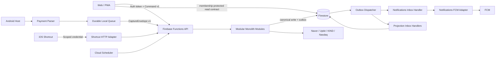
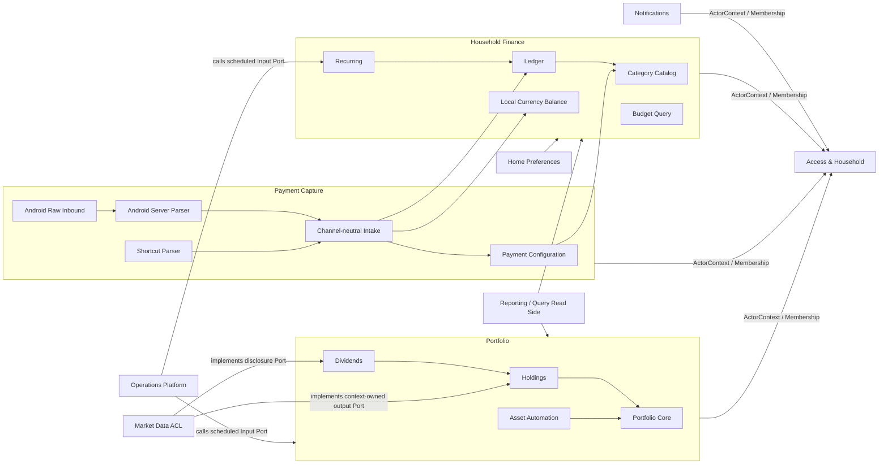
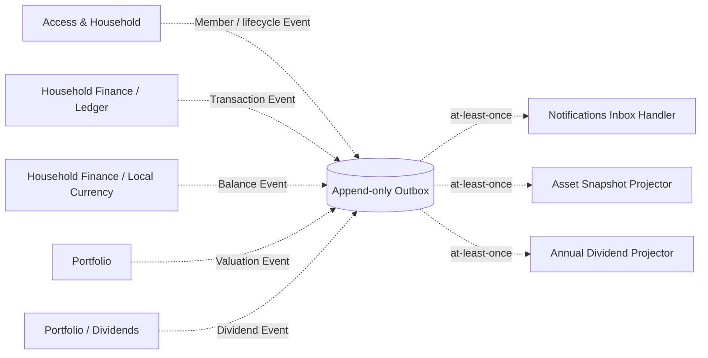

# Household Account 목표 Clean Architecture 설계

> 상태: Proposed — 구현 기준 설계  
> 기준일: 2026-07-15  
> 요구사항 기준: [현재 시스템 요구사항 인덱스](../requirements/README.md)  
> Context 요구사항 지도: [5개 업무 Bounded Context](../requirements/README.md#2-5개-업무-bounded-context)  
> 데이터 소유권: [데이터 소유권과 모듈 의존성](../requirements/cross-cutting/data-ownership.md)  
> 검증 기준: [요구사항 기반 테스트 전략](../requirements/governance/test-strategy.md)  
> 전환 계획: [Clean Architecture 리팩토링 전략](clean-architecture-refactoring-strategy.md)  
> 예약 작업: [Cloud 예약 작업 목표 설계와 운영 검증 기준](cloud-scheduled-operations.md)  
> 범위: Web/PWA, Android, Firebase Functions, Firestore, FCM, 외부 시세·공시 연동

## 1. 결론

이 시스템에 가장 적합한 구조는 **서버 권위형 모듈러 모놀리스 + 기능 우선 Clean Architecture + CQRS-lite + Transactional Outbox**다.

구체적으로 다음을 채택한다.

1. `web`, `functions`, `android`의 세 런타임 계열은 유지하고, Functions는 같은 모듈러 모놀리스 소스에서 지연 민감도별 codebase로 배포한다.
2. 업무 상태를 바꾸는 모든 Command의 최종 실행 지점은 Firebase Functions로 통일한다.
3. Functions 내부는 업무 경계별 모듈러 모놀리스로 구성하고, 각 모듈 안에서 Domain → Application → Adapter 방향을 강제한다.
4. Web과 Android는 업무 의도를 전달하고 읽기 계약을 소비하는 Client/Inbound Adapter가 된다.
5. 모듈 간 즉시 결과가 필요한 작업은 공개 Application Port, 비동기 후속 효과는 영속 Outbox Event로 연결한다.
6. Canonical Firestore 컬렉션·문서·필드에는 하나의 쓰기 소유자만 둔다. 여러 Context가 immutable Event를 추가하는 Outbox는 공통 append API로만 접근하는 명시적 플랫폼 예외다.
7. TypeScript와 Kotlin은 업무 코드를 억지로 공유하지 않고 버전이 있는 Schema와 비식별 fixture를 공유한다.
8. 현재 동작은 Facade와 Legacy Adapter 뒤에 두고 한 Vertical Slice씩 교체한다.
9. client의 cache·구독·비동기 callback은 검증된 SessionScope에 묶고, migration·repair와 release 권한은 사용자 bundle 밖의 운영 경계로 분리한다.

이 선택은 다음 대안보다 현재 시스템에 적합하다.

| 대안 | 채택하지 않는 이유 |
|---|---|
| 기능별 마이크로서비스 | 한 팀·하나의 Firebase 프로젝트 규모에서 배포, 인증, 분산 추적, 데이터 일관성 비용이 독립성 이득보다 크다. |
| 기존 Firestore 직접 접근 유지 | Web·Android·Functions에 최종 업무 판정과 Writer가 분산되어 보안, 원자성, 중복 제거를 강제할 수 없다. |
| 전통적인 수평 Layered Monolith | `components`, `services`, `repositories`처럼 기술 종류로 나누면 한 기능 변경이 저장소 전체로 퍼지는 현재 문제가 반복된다. |
| 전면 재작성 | 현재·호환·특성화·목표 요구사항을 한 번에 재구현하면 회귀와 데이터 손상 위험이 크다. |
| 19개 요구사항 문서와 19개 배포 모듈의 일대일 대응 | 요구사항 모듈에는 Domain, Projection, Workflow, 플랫폼 Adapter가 섞여 있어 같은 종류의 경계로 만들면 과도한 추상화가 생긴다. |

## 2. 설계 권위와 용어

문서가 충돌할 때 다음 순서로 판단한다.

1. [기능 모듈 요구사항](../requirements/README.md#1-문서-계층과-단일-소유)과 Accepted 제품 결정
2. 이 목표 아키텍처 설계
3. [리팩토링 전략](clean-architecture-refactoring-strategy.md)의 전환 순서
4. 현재 코드의 구조와 암묵적 관례

Pending 제품 결정은 이 문서가 임의로 확정하지 않는다. 대신 해당 정책을 교체 가능한 Port 또는 Policy로 격리하고, 데이터 손실을 막는 데 필요한 정보는 보존한다.

이 문서에서 사용하는 경계는 서로 다르다.

| 경계 | 의미 | 이 시스템에서의 예 |
|---|---|---|
| 배포 단위 | 독립적으로 빌드·배포되는 런타임 또는 서버리스 codebase | Web/PWA, Functions `default`·`payment-capture`·`access-session`, Android APK |
| Bounded Context | 같은 언어와 일관성 규칙을 공유하는 업무 경계 | Access, Household Finance, Payment Capture, Portfolio, Notifications |
| 기능 모듈 | 요구사항·테스트·데이터 또는 정책의 변경 소유 단위 | 거래 원장, 정기 거래, 결제 설정, 배당, 배포 안전성 등 19개 문서 |
| Application Workflow | 둘 이상의 기능 모듈을 공개 Port로 조정하는 유스케이스 | 결제 승인 반영, 가구 삭제, 자산 일일 갱신 |
| Adapter | OS, Firebase, HTTP, FCM, 외부 공급자를 내부 Port에 연결 | Android 알림 Listener, Firestore Repository, KIND Adapter |

요구사항 문서는 계속 기능 모듈의 단일 명세로 사용한다. 다만 요구사항 문서 하나가 마이크로서비스, Gradle 모듈 또는 Firestore 컬렉션 하나와 반드시 대응하지는 않는다.

## 3. 아키텍처 드라이버

### 3.1 변경의 국소성

다음 변경이 해당 소유 모듈과 계약 테스트 밖으로 전파되지 않아야 한다.

- 월 분할 정책 변경 → Ledger Domain과 테스트
- 새 카드 알림 형식 추가 → Android Payment Parser와 fixture
- 카드·가맹점 매칭 변경 → Payment Configuration과 계약 테스트
- FCM 공급자 변경 → Notifications의 FCM Adapter
- 시세 공급자 변경 → Market Data Adapter
- 통계 화면 변경 → Reporting Query/Presentation

### 3.2 업무 규칙의 단일 소유

중복 제거의 목표는 코드 줄 수가 아니라 **최종 결정권을 한 곳에 두는 것**이다.

- 월 분할·합치기·취소 원자성은 Ledger만 판정한다.
- 등록 카드와 가맹점 mapping은 Payment Configuration만 판정한다.
- Android·Shortcut 카드 승인은 Actor 본인 카드 집합에서 하나 이상 일치하면 허용하며 타 멤버 카드 상태와 본인 카드의 복수 일치는 거부 사유가 아니다.
- 연도 없는 결제 시각은 `PaymentOccurrenceYearPolicyV1`이 서울 수신 시각보다 미래가 아닌 가장 가까운 유효 연도로 결정하며 Android·Shortcut이 같은 fixture를 사용한다.
- Android와 Shortcut의 영속 결제 중복은 서버 Payment Capture가 fingerprint를 만들고 Ledger가 원자적으로 강제한다.
- 자산 합계는 Portfolio Core만 최종 반영한다.
- 알림 대상과 endpoint별 단일 전송 결과는 Notifications만 판정한다.
- Web과 Android의 입력 검증은 사용자 피드백용이며 서버 검증을 대체하지 않는다.

### 3.3 외부 공유와 가구 격리

[SYS-001](../requirements/system/context.md)과 [보안 경계](../requirements/cross-cutting/security-privacy.md)를 만족하려면 가구 키를 인증 수단으로 사용할 수 없다.

- Firebase Auth의 `uid`는 요청 주체다.
- `householdId`는 tenant 경계다.
- `memberId`는 표시 이름과 분리된 가구 내부의 안정 식별자다.
- `profileId`는 자산 명의 표시 이름과 분리된 안정 식별자이며 로그인·권한을 뜻하지 않는다.
- Membership은 `uid`, `householdId`, `memberId`, lifecycle status의 관계다. household owner role은 두지 않으며 모든 활성 가구원의 일반 capability는 동일하다.
- `memberId`와 `uid`는 같은 값으로 강제하지 않지만 신규 Member는 생성한 Google UID의 Membership에 즉시 연결한다. [DEC-034](../requirements/governance/decisions.md#dec-034)에 따라 UID 전역 `PrincipalMembershipClaim`으로 활성 Membership을 최대 하나만 허용하고 일반 가계부 선택·전환을 두지 않는다. [DEC-036](../requirements/governance/decisions.md#dec-036)에 따라 일반 사용자 탈퇴도 제공하지 않는다. [DEC-038](../requirements/governance/decisions.md#dec-038)에 따른 전체 관리자 제거만 일반 Member를 `removed`로 전환하고 claim을 해제하며, 복구는 다른 활성 claim이 없을 때 같은 ID를 재활성화한다. 미연결 Member는 기존 가구 키 사용자의 전환 기간에만 허용한다.
- 신규 사용자는 Google 로그인 뒤 자기 Member만 만들 수 있고 다른 Member를 미리 생성하거나 선택하지 않는다.
- Google 계정이 없는 아이 등은 Member가 아니라 Access의 `dependent AssetOwnerProfile`로만 추가한다. Member에는 연결된 `member` 프로필 하나를 제공하되 Asset은 memberId가 아닌 profileId를 참조한다.
- 기존 사용자는 localStorage의 householdKey·currentMemberId를 첫 로그인 migration 단서로 사용해 기존 householdId·memberId를 같은 UID Membership에 연결한다. 데이터는 복사하지 않는다.
- 모든 Command는 서버가 만든 `ActorContext`로 인가한다.
- Web·Android의 보호된 요청·cache·구독은 서버 검증을 마친 `SessionScope(sessionGeneration, principalUid, householdId, memberId)`를 명시적으로 받는다. 다음 첫 paint에서는 마지막 검증 SessionScope와 화면 snapshot을 localStorage 표시 hint로 먼저 복원할 수 있지만, 이를 tenant 권위나 Command ActorContext로 사용하지 않는다. 같은 UID의 Firebase Auth가 복원되면 Firestore Rules가 active Membership을 매 요청 검증하는 읽기 Query·listener를 재개하고, 백그라운드 Membership 재검증의 일시적 transport 실패는 이 읽기 준비 상태를 취소하지 않는다. 권위 거부·UID 불일치·first visit은 scope와 구독을 폐기하며, Command와 endpoint 등록은 계속 Auth·App Check·서버 Membership 인가에 수렴한다. `guest` fallback은 허용하지 않는다.
- 로그아웃·가구/멤버 전환은 이전 listener·요청·cache를 먼저 폐기하며 세대가 다른 늦은 callback은 화면·저장·endpoint 등록에 반영하지 않는다.

### 3.4 원자성·재시도·부분 실패

Firestore transaction callback, Cloud Functions, Scheduler, FCM, Android 네트워크 전송은 모두 재시도될 수 있다. 따라서 다음을 기본 전제로 한다.

단, DEC-025의 사용자 푸시 delivery는 재실행된 worker가 같은 FCM provider 호출을 반복하지 않도록 전송 시작을 먼저 claim하며, timeout·일시 오류에도 자동 provider 재전송을 수행하지 않는다.

- 같은 논리 작업의 재실행은 결과가 한 번만 반영되어야 한다.
- Domain 변경과 모듈 간 Event 기록은 같은 transaction에 들어간다.
- FCM·HTTP 같은 외부 부수 효과는 Firestore transaction 안에서 실행하지 않는다.
- 데이터 없음, 중복, 이미 처리됨, 일부 실패, 재시도 가능 실패를 성공과 구분한다.
- 대량 삭제와 여러 대상 job은 하나의 거대한 transaction이 아니라 checkpoint가 있는 Process Manager로 처리한다.

### 3.5 다중 런타임

Android만 OS 금융 알림에 접근할 수 있고 Web은 실시간 원장 UX가 필요하며 Functions는 서버 권한과 예약 작업을 가진다. 런타임 차이를 없애려 하지 않고 다음처럼 책임을 분리한다.

- Android: 알림 출처·원문을 순수 후보로 해석
- Shortcut Adapter: HTTP 입력을 같은 후보 계약으로 변환
- Functions: 권한, 설정, 영속 중복, 거래 변경을 최종 판정
- Web/PWA: Command 호출과 Read Model 표시

Web/PWA의 작업 실패, 확인, 텍스트 입력은 Presentation 계층의
`AppDialogProvider`를 통해 앱 내부 Portal로 표시합니다. 브라우저 기본
`alert`, `confirm`, `prompt`는 설치형 PWA와 Android WebView에서 웹 주소가
노출되는 외부 대화상자를 만들고 화면별 표현도 달라지므로 제품 코드에서
사용하지 않습니다. 업무 함수는 사용자 메시지를 결정하지 않고, 화면 또는
Presentation Adapter가 공통 대화상자 Port에 표시 요청을 전달합니다.

## 4. 런타임·배포 토폴로지



배포 원칙:

- Functions 모듈끼리 자기 HTTP endpoint를 다시 호출하지 않고 메모리 안의 공개 Port로 호출한다.
- Functions의 Domain·Application·Firebase Adapter 소스는 하나의 모듈러 모놀리스로 유지한다. 배포 entry만 `default`(일반 Command·Query·관리·예약 작업), `payment-capture`(Android raw·전환 envelope·Shortcut), `access-session`(Android 최초 WebView custom-token 교환)으로 나눠 scale-to-zero 뒤 대화형 호출이 관련 없는 Scheduler·Provider graph를 초기화하지 않게 한다.
- 현재 함수 이름과 배포 지역은 전환 중 Facade로 유지할 수 있다.
- Gen1→Gen2, TypeScript target 변경, 폴더 재구성, 업무 로직 이전을 한 변경에 묶지 않는다.
- 브라우저 Web·PWA·Android WebView의 Firestore 직접 접근은 명시적으로 공개한 읽기 계약에만 허용한다.
- 모든 Web runtime의 월·연 원장 목록은 Ledger가 소유한 같은 Firestore Read Contract를 사용한다. 검증된 SessionScope의 `householdId`와 날짜 범위로 복합 index를 사용하는 실시간 listener를 열고, 거래 유형과 lifecycle 가시성은 Ledger Read Adapter가 동일하게 적용한다.
- 일반 자산 화면의 활성 명의자 디렉터리는 Access가 공개한 `assetOwnerProfiles` Firestore Read Contract를 사용한다. 로컬 캐시를 먼저 내보내는 실시간 listener로 표시하고, 생성·이름 변경·보관은 Access Command를 통과시키며 관리자·과거 해석용 archived 포함 조회만 서버 Query를 사용한다.
- 원장 변경은 인증된 Functions Command를 통과시키되 client는 Command 전송과 동시에 낙관적 Projection을 화면에 반영한다. 서버가 반환한 Canonical 결과와 실시간 snapshot으로 확정·수렴하고 typed rejection이나 version conflict에서는 해당 변경만 rollback한다. 변경 뒤 별도 기간 Query를 호출하거나 30초 polling으로 화면을 갱신하지 않는다.
- Android에서는 Native Firebase Principal과 같은 UID의 Web Firebase Auth가 인증 권위다. 최초 설치·명시적 로그아웃 뒤에는 짧은 custom-token exchange를 사용하고, 이후 실행은 Web Auth local persistence를 먼저 복원해 반복 exchange를 생략한다. 마지막 서버 검증 UID·Membership·가구·현재 월 원장·가구별 카테고리 snapshot은 Auth observer보다 먼저 표시할 수 있으나 권한 증거가 아니며, 복원 UID 불일치·first visit·권한·authoritative household 부재가 확인되면 즉시 폐기한다. App Check와 Command 모듈은 첫 paint에서 지연하되 보호 callable 직전 반드시 초기화한다.
- Native Android 코드의 Domain 컬렉션 직접 읽기·쓰기는 최종적으로 제거한다. Android WebView 안의 Web runtime은 다른 Web runtime과 같은 공개 Firestore Read Contract만 사용한다.
- 운영 artifact는 [배포 안전성](../requirements/supporting-platform/modules/delivery-assurance/requirements.md) gate가 명시적 Firebase project, 계약 호환 순서, Rules·index·test·smoke를 검증한 뒤에만 배포한다.

## 5. Bounded Context와 기능 모듈

### 5.1 Context Map

다섯 업무 Bounded Context를 중심으로 지원·읽기·플랫폼 모듈을 둔다. 의존 방향과 런타임 Event 흐름을 한 화살표에 섞지 않는다.

다음 그림의 실선은 **호출자 또는 Adapter가 제공 모듈의 공개 Port에 의존하는 방향**이다. 즉 화살표는 일관되게 소비자에서 제공자로 향한다.



런타임 비동기 흐름은 별도로 표현한다. 점선은 producer가 Canonical 변경과 함께 Outbox에 기록하고 consumer Inbox가 처리하는 방향이다.



두 그림 모두 다른 모듈의 Repository나 Firestore 경로를 직접 호출한다는 뜻이 아니다. Operations Scheduler는 업무 Input Port만 호출하며 Market Data Adapter를 직접 조정하지 않는다.

### 5.2 19개 요구사항 모듈의 배치

| 요구사항 모듈 | 아키텍처 역할 | 배치 | 단일 소유 대상 |
|---|---|---|---|
| [가구와 접근](../requirements/contexts/access-household/modules/household-access/requirements.md) | 핵심 Domain/Application | Access & Household | Household, Member, Membership, AssetOwnerProfile, Invitation, 권한 |
| [거래 원장](../requirements/contexts/household-finance/modules/ledger/requirements.md) | 핵심 Domain/Application | Household Finance | 거래, 분할·합치기, 취소, 검색 계약 |
| [카테고리와 예산](../requirements/contexts/household-finance/modules/categories-budget/requirements.md) | Command Domain + Query Calculation | Household Finance | Category Catalog, Monthly Budget View |
| [정기 거래](../requirements/contexts/household-finance/modules/recurring-transactions/requirements.md) | Domain + Workflow | Household Finance | RecurringPlan, 월 처리 checkpoint |
| [결제 설정](../requirements/contexts/payment-capture/modules/payment-configuration/requirements.md) | 기준정보 Domain | Payment Capture | Card Registry, MerchantRuleSet |
| [지역화폐](../requirements/contexts/household-finance/modules/local-currency/requirements.md) | 독립 Aggregate | Household Finance | LocalCurrencyBalance |
| [Android 결제 수집](../requirements/contexts/payment-capture/modules/android-payment-ingestion/requirements.md) | Android Raw Adapter + Functions parser/Application | Payment Capture | raw 전달·서버 출처/parser·후보, 임시 Diagnostic Adapter |
| [Shortcut 결제 수집](../requirements/contexts/payment-capture/modules/shortcut-ingestion/requirements.md) | HTTP Inbound Adapter + parser | Payment Capture (Functions Adapter) | 요청·응답·Shortcut parser 계약 |
| [알림](../requirements/contexts/notifications/modules/notifications/requirements.md) | 지원 Domain/Application | Notifications | Member Notification Endpoint, Delivery |
| [Android Host](../requirements/supporting-platform/modules/android-host/requirements.md) | 플랫폼 Shell/Inbound Adapter | 지원·플랫폼 (Android Delivery) | 권한, WebView, Bridge, QuickEdit UI |
| [PWA](../requirements/supporting-platform/modules/pwa/requirements.md) | Web 플랫폼 Adapter | 지원·플랫폼 (Web Delivery) | manifest, 단일 worker 수명주기 |
| [포트폴리오](../requirements/contexts/portfolio/modules/portfolio/requirements.md) | 핵심 Domain/Application | Portfolio | AssetAccount, asset history/snapshot 계약 |
| [보유종목과 시세](../requirements/contexts/portfolio/modules/holdings-market-data/requirements.md) | Position Domain + Market ACL | Portfolio (Market Data ACL) | Position; 공급자 중립 Quote 계약 |
| [자산 자동화](../requirements/contexts/portfolio/modules/asset-automation/requirements.md) | Domain Policy + Workflow | Portfolio | AutomationPlan, 월 실행 key |
| [배당](../requirements/contexts/portfolio/modules/dividends/requirements.md) | Domain + Projection | Portfolio | DividendEvent, Annual Dividend Projection |
| [통계](../requirements/supporting-platform/modules/reporting/requirements.md) | 읽기 전용 Query | 지원·플랫폼 (Read Side) | 기간·집계 Query View |
| [홈 환경설정](../requirements/supporting-platform/modules/home-preferences/requirements.md) | 설정 + 읽기 조합 | 지원·플랫폼 (Preferences) | 홈 카드 구성; 테마는 Web local Adapter |
| [외부 운영](../requirements/supporting-platform/modules/external-operations/requirements.md) | 공통 Infrastructure | 지원·플랫폼 (Operations) | 오류 분류, job run, retry·관측 계약 |
| [배포 안전성](../requirements/supporting-platform/modules/delivery-assurance/requirements.md) | Release Control | 지원·플랫폼 (Delivery Assurance) | gate, 환경·project binding, 호환 배포·smoke 기록 |

중요한 분리 기준:

- `merchant_rules`는 예산이 아니라 Payment Configuration이 소유한다.
- `balances`는 Portfolio가 아니라 독립 LocalCurrencyBalance가 소유한다.
- 보유수량·평균단가는 Portfolio의 Position 업무 모델이고, Naver·Upbit·KIND 응답은 Market Data Anti-Corruption Layer다.
- QuickEdit 설정과 권한은 Android Host, 홈 카드 구성은 Preferences, 테마는 Web Presentation Adapter가 소유한다.
- External Operations는 자산·배당 업무 정책을 소유하지 않고 Scheduler·retry·관측만 구현한다.
- Delivery Assurance는 업무 기대값을 소유하지 않고 소유 모듈의 검증 결과와 배포 순서만 강제한다.

### 5.3 대표 공개 제공·소비 계약

아래 표는 Context 간 탐색을 위한 **대표 계약**이다. 전체 계약 이름과 상세 DTO·오류·테스트의 단일 원본은 각 [Bounded Context 요구사항 지도](../requirements/README.md#2-5개-업무-bounded-context)의 `공개 계약과 의존 방향` 절이다. 같은 유스케이스에 다른 동의어를 만들지 않고 구현 schema와 Context 문서의 이름을 일치시킨다.

| 제공 모듈 | 공개 Command·Query | 주요 소비자 |
|---|---|---|
| Access | `ResolveActorContext`, `AuthorizeHouseholdAction`, `ResolveSignedInUser`, `ClaimLegacyMembership`, `CreateHouseholdWithSelf`, `CreateInvitationCode`, `JoinHouseholdAsSelf`, `RenameSelf`, `Create/RenameAssetOwnerProfile`, 관리자 전용 `ArchiveAssetOwnerProfile`, `RemoveHouseholdMember`, `RestoreRemovedHouseholdMember`, `ListAssetOwnerProfiles`, `RequestHouseholdDeletion`, `RestoreDeletedHousehold`, `RequestPermanentHouseholdPurge`, `GetMembership`, `ListHouseholds` | 모든 가구 범위 Command와 Session Adapter, Portfolio·자산 UI, 승인된 관리자·운영 도구 |
| Category/Budget | `GetCategoryReference`, `ListActiveCategories`, `UpdateCategoryCatalog`, `ContinueCategoryArchiveProcess`, `SetDefaultCategory`, `GetMonthlyBudget`, `GetBudgetStatus` | Ledger, Recurring, Payment Configuration, archive worker, Home·Reporting read adapter |
| Ledger | `RecordManualTransaction`, `RecordCapturedTransaction`, `RecordRecurringTransaction`, `Update`, `Delete`, `Split`, `Merge`, `Unmerge`, `FindCancellationCandidates`, `CancelCapturedLineage`, `SearchLedger`, `SubscribeLedger`, `ListLocalCurrencyTransactions` | Web, QuickEdit, Payment Capture, Recurring, Reporting, Home 지역화폐 상세 |
| Recurring | `ManageRecurringPlan`, `ProcessDueRecurringPlans`, `ProcessRecurringMonth`, `RemapRecurringCategoryReferences` | Web, 일일 Scheduler, Category Archive Process |
| Local Currency | `RecordBalanceObservation`, `GetBalance`, `SubscribeBalance` | Payment Capture, Home query composition |
| Payment Configuration | `RegisterCard`, `UpdateRegisteredCard`, `DeleteRegisteredCard`, `ReorderCards`, `ResolveCard`, `ManageMerchantRules`, `ResolveMerchantMapping`, `RemapMerchantRuleCategoryReferences` | Web settings, Payment Capture, Category Archive Process |
| Payment Capture | `SubmitCaptureEnvelopeV1` | Android queue, Shortcut Adapter |
| Portfolio Core | 사용자: `CreateAsset`, `UpdateAsset`, `DeleteAsset`, `QueryPortfolio`; 운영 전용: `ListDeletedAssets`, `RestoreDeletedAsset`, `RequestPermanentAssetPurge`; 내부: `ApplyAssetValuation` | Web, Holdings, Automation, Reporting, 승인된 운영 도구 |
| Holdings | `ManagePosition`, `RevaluePositions`, `RefreshAccountPrices`, `RefreshHouseholdPrices`, `QueryPositions`, `QueryPositionHistory`, `RunDailyAssetValuation`, `PublishInstrumentCatalog` | Web, Scheduler, Dividends |
| Asset Automation | `ProcessDueAssetAutomation`, `RunContribution`, `RunRepayment`, `EvaluateAutomationMonth` | Scheduler/Application Workflow |
| Dividends | `RefreshDividendEvents`, `AdvanceDividendStatus`, `GetAnnualDividend` | Scheduler, Reporting |
| Notifications | `RegisterEndpoint`, `RemoveEndpoint`, `AcceptNotificationIntent`, `HandleHouseholdMemberRemoved`, `DeliverNotification`, `GetDeliveryStatus` | Web/Android, Ledger·Access event handler |
| Reporting | `GetLedgerStatistics`, `GetAssetStatistics` | Web |
| Preferences | `GetHomeConfiguration`, `SaveHomeConfiguration` | Web |
| External Operations | `RunScheduledJob`, `RecordProviderAttempt`, `RecordProviderRunOutcome`, `GetProviderHealth` | Scheduler, Market Adapter, 승인된 운영 도구·에이전트 |
| Delivery Assurance | `EvaluateReleaseCandidate`, `ResolveDeploymentTarget`, `VerifyCompatibilityWindow`, `RecordDeploymentResult` | CI, 승인된 배포 작업 |
| Household Finance Context Admin | `PurgeHouseholdData` | Access `HouseholdPurgeProcess`만 수동 호출 |
| Payment Capture Context Admin | `PurgeHouseholdData` | Access `HouseholdPurgeProcess`만 수동 호출 |
| Portfolio Context Admin | `PurgeHouseholdData` | Access `HouseholdPurgeProcess`만 수동 호출 |
| Notifications Context Admin | `PurgeHouseholdData` | Access `HouseholdPurgeProcess`만 수동 호출 |

공개 Port는 소비자가 필요한 최소 DTO만 반환한다. Entity, Repository, Firestore Mapper, 공급자 DTO는 공개하지 않는다.

네 downstream Context의 `PurgeHouseholdData(householdId, processId, checkpoint)`는 일반 논리 삭제에서 호출하지 않는다. 별도 요청과 확인을 받은 `HouseholdPurgeProcess`만 수동 호출한다. Access는 `purging` 전환 후 Membership·claim 변경 명령을 막고, 현재 UID claim의 server-only snapshot을 결정적 page로 먼저 완성한 뒤 downstream purge를 시작한다. 각 purge 명령은 멱등적이고 page 단위로 공통 `PurgePageResult`를 반환한다. 결과는 `PageProcessed(nextCheckpoint, deletedCount)`, `PurgeCompleted(finalCheckpoint, deletedCount)`, `RetryableFailure(retryCheckpoint, errorCode)`, `PermanentFailure(failedCheckpoint, errorCode)`를 구분한다. 첫 호출의 checkpoint는 `null`이고 이후 checkpoint는 제공 Context만 해석하는 opaque token이다. Notifications는 현재 해당 가구에 연결된 endpoint·delivery·Inbox만 제거한다.

### 5.4 금지 의존성

- 클라이언트 또는 입력 Adapter가 `expenses`, `assets`, `fcmTokens` 등 Canonical 컬렉션을 직접 쓰는 구조
- 한 모듈이 다른 모듈의 `infrastructure`, Repository, Firestore 경로를 import하는 구조
- Access가 이름 변경이나 가구 삭제를 위해 카드·자산·알림 컬렉션을 직접 순회하는 구조
- Payment Capture나 QuickEdit이 Ledger 문서를 직접 추가·삭제·분할하는 구조
- Ledger가 Merchant Rule이나 Notification Endpoint를 직접 저장하는 구조
- Holdings·Automation이 `assets`를 직접 덮어쓰는 구조
- Reporting·Home이 거래·자산 원본을 수정하는 구조
- Domain이 React, Next.js, Firebase, Android SDK, HTTP client, 공급자 DTO를 import하는 구조
- `shared`에 Expense, Asset, Card, Category 같은 업무 모델을 이동하는 구조
- Scheduler/Cloud Function wrapper 안에 업무 규칙을 작성하는 구조
- `notification_debug_logs`를 Domain Event나 영구 감사 Aggregate로 승격하는 구조
- 기능 모듈이 공통 `OutboxAppendPort`를 우회해 Outbox Firestore 경로를 직접 쓰거나 기존 Event envelope를 수정하는 구조
- client service·Repository가 localStorage 또는 부분 Native preference를 직접 읽어 tenant를 선택하거나 `guest`를 보호 데이터의 fallback으로 쓰는 구조
- browser/일반 앱 bundle이 전역 migration·repair 또는 운영 가구 sample-data writer를 export하는 구조
- 외부 공급자가 반환한 absolute URL을 HTTPS host/path·redirect 검증 없이 fetch하거나 사용자 입력 수만큼 무제한 fan-out하는 구조
- implicit Firebase default project와 compile 성공만으로 운영 deploy를 실행하는 구조

## 6. 모듈 내부 Clean Architecture

### 6.1 기본 의존 방향

```text
Inbound Adapter ──▶ Input Port / Application ──▶ Domain
                               │                    ▲
                               ▼                    │
                         Output Port ◀──── Outbound Adapter

Composition Root만 구체 Adapter를 조립한다.
```

| 출발 | 허용 의존 | 금지 의존 |
|---|---|---|
| Domain | 같은 기능 Domain, 최소 Shared Kernel | Application, Firebase, React, Android, 다른 기능 Entity |
| Application | 자기 Domain, Input/Output Port, 다른 모듈의 공개 Port | UI, 구체 Repository, 공급자 SDK |
| Inbound Adapter | 공개 Input Port, Transport Mapper | Domain Repository, 다른 모듈 내부 구현 |
| Outbound Adapter | 자기 모듈 Output Port, 외부 SDK | 업무 정책 결정, 다른 모듈 컬렉션 쓰기 |
| Composition Root | 모든 구체 구현의 생성·연결 | 업무 규칙 |

모든 클래스에 Interface를 만들지 않는다. 저장소, 외부 시스템, 시간·ID, transaction, 다른 Context처럼 실제 경계를 교체하거나 Fake로 검증해야 할 때만 Port를 만든다.

### 6.2 Functions 기능 모듈 형식

```text
modules/<capability>/
  domain/
    entities/
    value-objects/
    policies/
  application/
    commands/
    queries/
    event-handlers/
    ports/
      in/
      out/
  adapters/
    in/
      callable/
      http/
      scheduler/
    out/
      firestore/
      provider/
  public.ts
```

`public.ts`만 모듈 외부 import를 허용한다. 다음 항목만 export한다.

- Input Port
- Command/Query DTO와 typed Result
- 공개 Read Model
- Versioned Integration Event schema
- 소비자가 처리해야 하는 안정적인 오류 코드

다음 항목은 export하지 않는다.

- Domain Entity와 내부 Policy 구현
- Repository Port와 Firestore Mapper
- 공급자 DTO
- Composition Root의 구체 인스턴스

### 6.3 플랫폼 모듈에 가짜 Domain을 만들지 않는 원칙

PWA, Android Host, Theme, External Operations, Delivery Assurance처럼 업무 Entity가 없는 모듈에 형식만 맞추기 위한 `domain` 폴더를 만들지 않는다.

- PWA: manifest/worker Adapter와 통합 테스트
- Android Host: Activity, WebView/권한 Port, Bridge Adapter
- Theme: Web Presentation 상태와 local storage Adapter
- External Operations: Scheduler runner, retry, observability Adapter
- Delivery Assurance: release manifest validator, gate runner, environment/project binding, deploy/smoke Adapter

Clean Architecture는 모든 폴더가 같은 모양이라는 뜻이 아니라 업무 정책이 Framework 안쪽으로 새지 않는다는 뜻이다.

### 6.4 Context Application Workflow와 Unit of Work

하나의 Bounded Context 안에서도 서로 다른 기능 모듈이 각자 소유한 문서를 강한 일관성으로 함께 바꿔야 할 수 있다. 이때 한 기능의 공개 Command가 먼저 commit한 뒤 다른 기능을 호출하거나, 한 기능이 다른 기능의 Repository를 import하지 않는다. **Context Application Workflow**가 해당 유스케이스의 유일한 조정자이자 Unit of Work 소유자가 된다.

```text
Inbound Adapter
  → Context Workflow Input Port
  → 기능별 Domain Policy / context-private transaction participant
  → Context UnitOfWork
       ├─ 각 기능 소유 문서 변경
       ├─ idempotency receipt
       └─ OutboxAppendPort
  → typed result
```

규칙:

- Workflow는 Context의 Application 계층에 있으며 Domain Entity나 Infrastructure transaction handle을 공개 DTO로 노출하지 않는다.
- 기능별 transaction participant는 commit하지 않고 변경 의도와 검증 결과를 Workflow에 제공한다.
- 하나의 Firestore Adapter가 Context Unit of Work를 구현하되 문서별 논리 Writer는 원래 기능 모듈로 유지한다.
- Workflow 밖의 일반 Command는 자기 Aggregate만 commit한다.
- transaction callback 재실행 중 외부 HTTP, FCM, UI broadcast, Scheduler 호출을 실행하지 않는다.
- 이 패턴이 Context 경계를 넘어 필요해지면 강한 원자성 요구를 다시 검토하고 Saga·Outbox로 전환한다.

현재 허용하는 Context Workflow는 다음과 같다.

| Workflow | 조정 기능 | 같은 Unit of Work |
|---|---|---|
| `ProcessRecurringMonthWorkflow` | Recurring + Ledger | plan execution/checkpoint, recurring transaction, receipt, Outbox |
| `RevalueAssetWorkflow` | Holdings + Portfolio Core | Position 변경, Asset valuation/version, receipt, Outbox |
| `ApplyAssetAutomationWorkflow` | Asset Automation + Portfolio Core | execution claim, Asset 변경, receipt, Outbox |
| `RestoreAssetWorkflow` | Portfolio Core + Asset Automation | 관리자 capability·감사 사유, Asset active 전환, 삭제 구간·resume revision, receipt, Outbox |

`HouseholdPurgeProcess`와 `AssetPurgeProcess`는 여러 소유 모듈과 대량 문서를 다루므로 이 표의 단일 transaction Workflow가 아니라 checkpoint 기반 Process Manager다. 일반 논리 삭제는 각 소유 Core의 단일 UoW다. 자산 복구는 일반 사용자 기능이 아니라 Portfolio 내부 `RestoreAssetWorkflow`가 Core와 Automation resume 경계를 한 UoW로 확정하며 Purge Process를 만들지 않는다.

## 7. Command, Query, Event 계약

### 7.1 Command 흐름

```text
Transport DTO
  → Schema validation
  → Firebase ID token / scoped credential 검증
  → ActorContext 생성과 가구 인가
  → Application Use Case
  → Domain Policy
  → Unit of Work: Canonical write + idempotency receipt + Outbox
  → typed Command Result
```

클라이언트가 보낸 `actorId`, `role`, `householdId`를 그대로 신뢰하지 않는다. Transport Adapter가 인증 주체를 Application의 `ActorContext`로 변환하고, Use Case가 대상 가구의 권한을 다시 검증한다.

권장 공통 envelope의 의미는 다음과 같다.

| 필드 | 의미 |
|---|---|
| `contractVersion` | Wire schema 버전 |
| `commandId` | 호출 추적·상관관계용 ID. 매 호출마다 달라도 된다. |
| `idempotencyKey` | 같은 논리 작업의 재시도 key. 같은 key와 다른 payload는 Conflict다. |
| `householdId` | 명시적 tenant 범위. ActorContext와 일치해야 한다. |
| `payload` | 유스케이스별 입력 |

`ActorContext`는 서버 내부 타입이며 최소 `principalUid`, `householdId`, `actingMemberId`, `principalKind`, `capabilities`를 가진다. 일반 사용자의 `actingMemberId`는 Membership의 자기 memberId에서 서버가 도출하며 클라이언트 선택값이 아니다. `principalKind`와 capability는 인증된 전체 관리자·SystemActor를 일반 Membership과 분리하기 위한 서버 값이며 household owner를 뜻하지 않는다. Scheduler는 제한된 Capability를 가진 `SystemActor`를 사용한다.

### 7.2 Query와 CQRS-lite

Command 모델과 화면 모델을 분리하되 모든 조회를 처음부터 물리 Projection으로 복제하지 않는다.

1. 단순하고 보안상 안전한 실시간 목록은 소유 모듈이 공개한 Firestore Read Contract를 구독할 수 있다.
2. Web의 Firebase import는 `features/<module>/adapters/firestore-read-model` 안에만 둔다.
3. 민감 조회, 여러 Aggregate 조합, 비용이 큰 조회는 서버 Query Port를 사용한다.
4. 예산·지출 통계·홈 요약은 요청 시 Canonical Query에서 계산하고 별도 영속 Projection을 만들지 않는다. 일일 자산 Snapshot·연간 배당처럼 생성 시점과 Writer가 명확한 조회 모델만 물리화한다.
5. 홈 카드 configuration은 Preferences의 versioned Aggregate다. 모든 활성 가구원은 서로 다른 left·right 유형만 저장할 수 있고, 기존 중복 구성은 읽기 호환하되 자동 보정하지 않는다. 카드 구성과 선택 지역화폐 유형은 독립 필드이며 한 Command가 다른 필드를 암묵적으로 바꾸지 않는다.
6. 물리 Projection은 Canonical 데이터가 아니며 재구축 가능해야 한다.
7. client Query·listener는 `SessionScope`와 명시적 householdId를 받고 `sessionGeneration`이 바뀌면 취소·폐기한다. localStorage는 composition 경계에서 legacy claim 또는 마지막 서버 검증 session·가구·현재 월 원장·가구별 카테고리 표시 hint에만 사용하며 Repository의 tenant 선택이나 서버 권한 근거로 사용하지 않는다.
8. 목록·검색·이력 Query는 서버 조건, 결정적 정렬, opaque cursor와 최대 page 크기를 가지며 전체 가구 데이터를 내려 client에서 필터링하지 않는다.
9. `NoData`, 유효한 0, `Forbidden`, provider/query 실패를 typed 결과로 구분한다. 물리 Projection에서만 필요할 때 stale/rebuilding metadata를 추가한다.

각 물리 Projection은 다음을 문서화한다.

- 단일 Writer와 schema version
- 원천 Event와 마지막 처리 checkpoint
- 중복·순서 역전 처리 방식
- 전체 rebuild 명령
- 허용 freshness와 UI의 갱신 중 표시
- 기간 통계의 시작 직전 baseline, gap/carry-forward 의미와 실패 표시. 자산 차트는 DEC-048에 따라 최초 Snapshot 전은 비우고 이후 공백은 직전 값을 일반 값으로 유지한다.

`projections/{projectionId}` 같은 범용 컬렉션 하나에 모든 형태를 넣지 않는다. 물리화가 승인된 `assetSnapshots`, `dividendAnnualViews`처럼 소유자가 드러나는 이름을 사용한다.

### 7.3 모든 모듈 간 비동기 효과는 Durable Outbox 사용

Cloud Functions 프로세스 내부 Event Bus만으로는 commit 직후 종료될 때 Event가 유실될 수 있다. 따라서 모듈을 넘는 모든 비동기 효과는 Canonical 변경과 같은 Firestore transaction에 Outbox 문서로 기록한다.

Outbox는 여러 producer가 immutable Event 문서를 **추가**해야 하므로 Canonical collection 단일 Writer 규칙의 명시적 플랫폼 예외다. 예외 범위는 다음으로 제한한다.

- 각 `eventType + eventVersion`에는 정확히 하나의 producer 기능 모듈을 등록하며, 해당 producer가 Event payload의 논리 소유자다.
- producer는 Application 계층의 공통 `OutboxAppendPort`만 호출한다. 이 Port는 현재 Unit of Work에 참여하고 envelope·schema·producerContext를 검증한다.
- 공통 Firestore Outbox Adapter만 물리 경로에 create할 수 있다. 기능 모듈은 Outbox collection name이나 mapper를 알지 않는다.
- 생성된 Event envelope와 payload는 처리 중 수정·삭제하지 않는다. Dispatcher의 lease·attempt·결과는 별도 플랫폼 dispatch receipt에 기록한다. 모든 필수 consumer가 terminal인 Event만 DEC-046의 terminalAt+30일 플랫폼 TTL 정리 대상이 된다.
- Dispatcher는 전달과 lease만 소유한다. Notifications 수신자·payload·FCM 정책이나 Projection 계산을 실행하지 않고 각 consumer Inbox Handler에 전달한다.
- CI는 직접 Outbox Firestore write, 하나의 Event type에 둘 이상의 producer 등록, append 뒤 envelope mutation을 실패시킨다.

Event envelope:

```text
eventId
eventType + eventVersion
householdId
aggregateId + aggregateVersion
occurredAt
correlationId + causationId
payload
```

전달 보장은 at-least-once다.

- Consumer는 `(eventId, handlerName)` Inbox/Delivery key로 멱등 처리한다.
- 동일 Aggregate의 순서가 중요한 Handler는 `aggregateVersion`을 확인한다.
- 재시도 가능 실패, 영구 계약 실패, dead letter를 구분한다.
- Event payload에는 알림 원문과 불필요한 개인정보를 넣지 않는다.
- Notifications의 inactive endpoint와 terminal Inbox·Intent·Delivery·command receipt는 DEC-027에 따라 30일 보존하고 active endpoint에는 TTL을 두지 않는다. 그 밖의 정상 terminal receipt·완료 Outbox/Inbox·JobRun은 DEC-046에 따라 30일 보존하며 unresolved 기록은 해결 전 자동 삭제하지 않는다. AutomationExecution과 업무 claim·tombstone은 Aggregate·수동 purge 수명주기를 따르고 release manifest는 자동 TTL 없이 장기 보존한다.

대표 Event:

- `TransactionRecorded.v1`
- `TransactionChanged.v1`
- `TransactionDeleted.v1`
- `HouseholdNotificationRequested.v1`
- `MemberRenamed.v1`
- `HouseholdMemberRemoved.v1`
- `HouseholdMemberRestored.v1`
- `AssetValuationChanged.v1`
- `DividendEventChanged.v1`
- `DividendEventRemoved.v1`

Event Sourcing은 도입하지 않는다. Event는 Context 간 확정 사실 전달과 Projection 갱신에만 사용한다.

### 7.4 오류 계약

예외를 빈 배열, 0원, 성공 Toast로 축약하지 않는다.

```text
Success<T>
ValidationError
Unauthenticated
Forbidden
NotFound
Conflict
Duplicate(existingId)
AlreadyProcessed(existingId?)
NeedsConfirmation(candidates)
NoData
RetryableFailure(code, retryAfter?)
ContractFailure(code)
PartialFailure(succeeded, failed)
```

Transport Adapter만 이를 HTTP/callable status로 변환한다. Domain과 Application은 Firebase 예외 타입을 알지 않는다.

## 8. 핵심 업무 흐름

이 절은 [모듈 간 종단 흐름](../requirements/system/flows.md)의 현재 동작과 교정 불변식을 목표 Port·transaction·event 흐름으로 구체화한다.

### 8.1 Web 수동 거래

```text
Ledger UI
  → RecordManualTransaction.v1
  → ActorContext/CategoryReference 검증
  → Ledger Domain 생성
  → transaction + outbox를 원자 저장
  → Created(transactionId)
  → Read Contract 구독이 저장 결과로 수렴
```

- 화면은 양수 금액과 필수 입력을 먼저 안내하지만 서버가 다시 검증한다.
- 거래와 `TransactionRecorded.v1`은 같은 transaction으로 commit한다.
- 푸시 후속 처리 실패는 거래 생성을 롤백하지 않는다. 예산·지출 통계는 저장된 View를 갱신하지 않고 다음 조회에서 Canonical 거래를 다시 계산한다.
- 후속 Handler의 상태는 별도의 Delivery 또는 실제 영속 Projection 상태로 관측한다.

일반 거래 삭제도 Ledger가 단독 소유한다. `DeleteTransaction`은 active·expectedVersion을 확인하고 본문과 provenance를 보존한 채 `deleted` 전이, receipt, `TransactionDeleted.v1`을 한 UoW로 commit한다. 모든 일반 Query와 Projection은 active 집합만 노출하므로 삭제 결과가 목록·검색·집계에서 즉시 사라진다. deleted 거래에는 TTL이 없고 일반 사용자의 복구·물리 삭제 Port를 두지 않는다. 사용자가 실수 복구나 최종 삭제를 별도로 요청한 경우에만 운영자/Agent 전용 Workflow가 감사 사유와 종속 lineage를 확인하여 같은 ID 복구 또는 소유 데이터 정리를 수행한다. capture 취소와 가구 전체 purge는 각각 DEC-041과 HouseholdPurgeProcess 경계를 따른다.

### 8.2 Android·Shortcut 결제 승인

Android 원문과 Shortcut message는 서로 다른 Functions parser Adapter를 가지지만 최종 판정은 하나의 서버 유스케이스를 사용한다.

```mermaid
sequenceDiagram
    participant C as Android Raw / Shortcut Adapter
    participant SP as Functions Parser
    participant P as Payment Capture
    participant PC as Payment Configuration
    participant L as Ledger
    participant B as Local Currency
    participant O as Outbox

    C->>SP: AndroidRawNotification.v1 또는 Shortcut message
    SP->>P: 내부 CaptureEnvelope.v1 + idempotencyKey
    P->>P: receipt claim; present branch 확인
    par payment branch가 있을 때
      P->>PC: ResolveCard / ResolveMerchantMapping
      PC-->>P: deterministic mapping result
      P->>L: RecordCapturedTransaction(fingerprint, draft, captureRef)
      L->>L: fingerprint claim + transaction + lineage + outbox atomic commit
      L-->>P: Created / Duplicate / Rejected / NeedsConfirmation
    and balance branch가 있을 때
      P->>B: RecordBalanceObservation
      B-->>P: Updated / AlreadyCurrent / Failed
    end
    P-->>C: paymentResult? + balanceResult?
    O-->>O: async projection / notification delivery
```

핵심 규칙:

- Android는 OS 알림 접근, 등록 package allowlist, 다목적 앱의 개인정보 최소화 admission, 암호화 Queue만 소유한다. 공급자별 정규식과 parser ID/version은 소유하지 않는다.
- Functions Android Raw Adapter는 strict raw schema를 검증하고 서버 Source Registry로 출처·parser를 확정한 뒤 공급자 TypeScript parser를 실행한다. 클라이언트 `householdId`, creator, source, parser 주장은 받지 않는다.
- Shortcut HTTP Adapter는 요청 인증과 Shortcut message parser를 소유한다.
- Android는 `AndroidRawNotification.v1`으로 Functions에 들어오고 서버 parser가 결제 후보와 잔액 관찰 중 하나 이상을 가진 내부 `CaptureEnvelope.v1`을 만든다. Shortcut parser도 같은 내부 Intake 계약을 만든다. balance-only 입력을 정상 계약으로 허용한다.
- `CaptureEnvelope.v1.sourceEvidence`는 channel-discriminated union이다. Android는 등록 package·Registry version, Shortcut은 검증된 credential 식별 hash를 보존하며 Shortcut에 가짜 package를 채우거나 Android evidence에 credential을 섞지 않는다.
- 두 채널 parser는 DEC-029의 연도 Policy 계약을 공유해 미래 연도의 결제일을 만들지 않는다. 채널별 현재월 휴리스틱은 Legacy Adapter에만 둔다.
- 카드 eligibility·가맹점 mapping은 Payment Configuration이 한 번만 판정한다. 카드 조회는 `ActorContext.actingMemberId` 범위로 먼저 제한하며 본인 카드가 하나 이상 일치하면 허용한다.
- [DEC-003](../requirements/governance/decisions.md#dec-003)의 fingerprint는 Payment Capture가 한 번만 계산한다.
- Ledger는 fingerprint 예약과 거래 생성을 같은 Firestore transaction으로 강제한다.
- 결과는 반드시 `Created(transactionId)`와 `Duplicate(existingTransactionId)`를 구분한다.
- 유효한 지역화폐 잔액 관찰은 결제 parse·카드 매칭·거래 생성의 성공, 중복, 거부, 실패와 독립적으로 한 번 처리한다. 결제 branch 실패가 balance branch를 억제하거나 그 반대가 되어서는 안 된다.
- 지역화폐 결제 거래는 검증된 capture의 `localCurrencyType`을 immutable하게 보존한다. 홈 카드 상세는 클릭 시 선택 type 하나를 Ledger Query에 고정 전달하고 내부 전체·유형 전환 UI를 두지 않으며, legacy unknown은 일반 원장에서만 조회한다.
- Android QuickEdit은 `Created` 또는 편집 가능한 확정 ID를 받은 뒤에만 연다.
- 연속 QuickEdit은 Android Host의 Keystore 암호화 표시 FIFO에 session scope·거래 ID·sequence와 선택적 서버 확정 `quickEditSnapshot`을 저장한다. 한 번에 하나만 표시하고 명시 닫기 또는 별도 command outbox의 영속 접수 뒤 다음 항목으로 진행한다. 새 snapshot entry는 두 번째 Ledger Query 없이 표시하고 구버전 ID-only entry만 최신 snapshot을 조회하며, 동시 변경은 후속 Command의 expectedVersion이 최종 검증한다.
- QuickEdit은 별도 Domain 기능이 아니라 일반 Ledger Update·Delete·Split·알림 요청 use case의 Android 입력·전달 Adapter다. 고정 commandId·idempotencyKey와 versioned payload를 별도 Keystore 암호화 command outbox에 commit하고 WorkManager 영속 예약까지 완료한 뒤 Activity에서 분리한다. commit부터 영속 예약·접수 판정까지는 session purge와 같은 짧은 lifecycle 임계 구역으로 보호하되 서버 왕복은 그 밖에서 실행하여 다음 QuickEdit 접수를 막지 않는다. WorkManager가 같은 envelope로 접수 후 정확히 72시간 전까지 FIFO 재시도하며 앞 명령을 뒤 명령이 추월하지 않는다. Success·AlreadyProcessed는 즉시 삭제하고, 충돌·영구 거부·계약 실패·만료는 Command 자동 재시도 없이 실패 알림 전달 전까지만 needs-attention으로 보존한 뒤 민감값 없는 알림 성공 시 payload를 삭제한다. 알림 차단은 Worker 재시도를 유지하고, 복호화·codec 손상은 payload를 fail-closed 삭제하되 비민감 손상 신호를 남긴다. Activity 종료를 업무 성공 Toast나 완료 event로 해석하지 않는다.
- QuickEdit 분할은 화면의 현재 미저장 form을 immutable base draft로 고정해 expectedVersion과 함께 Ledger `Split` 한 번으로 보낸다. 서버는 provenance를 원본에서 보존하고, 다른 사용자의 Update·Split이 먼저 commit되어 version이 바뀌면 stale 요청 전체를 Conflict로 거부한다.
- 모든 채널은 검증된 creatorMemberId, 업무 source, 명시적 originChannel을 Ledger에 전달한다. creator 유무를 알림 전송 gate로 사용하거나 source 하나에 업무 출처와 입력 채널 의미를 겹치지 않는다.
- Android 자동 등록은 로컬 QuickEdit만 실행하고 푸시를 만들지 않으며, iPhone Shortcut 자동 등록은 creator 본인의 iPhone endpoint에 편집 링크 푸시를 만든다.
- 타 멤버의 동일 카드사·wildcard 카드는 자동 등록 eligibility에 참여하지 않는다. 본인 카드가 여러 건 일치하면 거래는 생성하되 특정 카드를 저장 순서로 임의 선택하지 않고 parser evidence를 유지한다.
- 명시적 `알림 보내기`는 requester를 제외한 활성 가구원 전체를 대상으로 하며 자동 거래 생성 알림과 별도 Policy로 처리한다.
- Payment Capture의 취소·잔액 동시 처리·Shortcut 같은 복합 envelope는 `observationId + idempotencyKey`의 payload hash와 branch별 stable downstream key·typed 결과를 `CaptureSubmissionReceipt`로 보존한다. root claim 뒤 정상 한 실행에서는 중간 processing/branch 상태를 매번 직렬 저장하지 않고 모든 branch 결과를 마지막에 한 번 저장한다. 최종 `partial-retryable`에 이미 기록된 terminal branch는 다음 시도에서 건너뛴다.
- 단일 Android 승인 branch는 Ledger가 거래·fingerprint claim·Outbox·멱등 receipt를 한 transaction에서 확정하므로 별도 Capture root receipt를 만들지 않는다. 복합 경로에서 Ledger·Local Currency commit 뒤 최종 `CaptureSubmissionReceipt` 저장 전에 중단되면 재시도는 같은 fingerprint·downstream key로 각 Context의 멱등 결과를 복구한 뒤 receipt를 완성한다.
- `submitAndroidRawNotification`, `executeHouseholdCommand`, `executeHouseholdQuery`는 현재 소규모·비용 우선 운영에서 `minInstances=0`을 사용한다. Android 세션 교환은 서버가 해석한 활성 householdId·memberId를 Native 전용 custom token의 서명된 최소 claim으로 발급하고, 정상 capture는 검증된 ID token claim으로 ActorContext를 만들어 Membership Firestore read를 수행하지 않는다. claim이 없는 구 APK는 UID 전역 `PrincipalMembershipClaim` 한 문서를 읽고, 그 문서도 없는 전환 데이터만 기존 Membership view·canonical 검증으로 fallback한다. process가 warm인 동안에는 fallback으로 성공한 활성 Membership을 최대 5분·64개, 성공한 결제 설정 snapshot을 최대 1분·32개만 bounded process-local cache로 재사용한다. Auth·App Check 검증은 모든 요청에서 유지하며 단계별 latency 계측 뒤 cold start가 목표 지연을 지배할 때에만 특정 Function의 warm instance를 재검토한다.
- Android capture의 카드·가맹점 규칙·활성 카테고리는 `runtimeProjections/payment-capture-configuration-v1` 단일 문서로 조합한다. projection miss는 원본과 projection을 한 transaction에서 읽고 쓰며, Payment Configuration·Category Catalog Writer가 변경 transaction에서 projection을 삭제한다. 따라서 cold instance도 정상 steady state에서는 설정 문서 하나만 읽고, 변경과 재생성이 겹쳐도 오래된 projection이 변경 뒤 다시 살아나지 않는다.
- 서버 parser가 결제 branch를 만든 직후 설정 projection prefetch를 시작해 root receipt claim과 병렬 실행한다. transaction gateway가 같은 in-flight 조회를 재사용하므로 이 병렬화가 설정을 이중 조회하거나 Domain 판정 순서를 바꾸지 않는다.
- 대화형 경계는 Web Performance mark/measure, Functions 구조화 `interactive-latency`, Android `HHCaptureLatency`를 사용한다. 사용자·가구·거래·금액·원문은 기록하지 않으며 Android와 Functions는 `SHA-256(observationId).slice(0, 16)`만 상관키로 공유한다.
- 승인 후보의 원 금액, 정규화 전후 가맹점 증거, 카드 증거, 발생 시각, source·parser version, observation/capture ID는 immutable `CaptureProvenance`로 보존한다. Ledger의 사용자가 편집하는 표시 필드와 분리하고 split·merge 파생 거래가 같은 capture lineage를 잃지 않게 한다.

권장 `CaptureEnvelope.v1` 개념:

```text
observationId
originChannel
sourceEvidence {
  android-registered-package: sourceType / packageName / registryVersion
  or ios-shortcut-credential: sourceType / credentialIdHash
}
observedAt
optional paymentObservation {
  approval | cancellation
  amount
  merchantEvidence
  cardEvidence
  occurredLocalDate / occurredLocalTime / zoneId
  optional dueDate
}
optional balanceObservation
rawPayloadHash
parserId / parserVersion
```

내부 `paymentObservation`과 `balanceObservation`이 모두 없으면 Capture Intake에 진입하지 않고 raw 호출을 terminal ignored로 종료한다. Shortcut은 `paymentObservation`만 만들고 Android server parser는 둘 중 하나 이상을 만들 수 있다. Android raw 원문은 암호화 write-ahead journal과 callable Wire에는 존재하지만 요청 처리 뒤 Capture receipt, Ledger, Domain Event, Outbox, 일반 로그에 저장하지 않는다. [DEC-002](../requirements/governance/decisions.md#dec-002)와 [DEC-047](../requirements/governance/decisions.md#dec-047)의 별도 best-effort Diagnostic Adapter만 기능 제거 전까지 원문을 보존하며 업무 결과와 결합하지 않는다.

### 8.3 Android write-ahead journal과 실패 Queue

서버 권위 Command로 전환해도 원격 호출 중 process 종료나 일시적 네트워크 장애 때문에 알림 수집이 사라지면 안 된다.

```text
queued → submitting → confirmed | duplicate | rejected | needs-review
                 └── retryable-failure → queued
```

- Android는 `AndroidRawNotification.v1`과 안정적인 observation ID를 원격 호출 직전 Android Keystore 키 기반 AES-256-GCM journal에 저장한다.
- 정상 온라인 경로는 WorkManager를 예약하지 않고 바로 Functions를 호출한다. terminal follow-up이 있으면 expected SessionScope의 QuickEdit FIFO에 먼저 내구화하고 capture journal을 ack/delete한 뒤 Activity를 연다.
- 직접 호출 실패, `partial-retryable` 또는 QuickEdit FIFO enqueue 실패에서는 entry를 남기고 `APPEND_OR_REPLACE` unique WorkManager를 예약해 같은 key로 재시도한다. Queue가 비어 있으면 Worker를 예약하지 않는다.
- 인증 만료는 재인증 대기 상태와 영구 거부를 구분한다.
- 실패 Queue entry는 생성 후 72시간까지만 재시도한다. parser 무결과를 포함한 `completion=terminal`은 follow-up 내구화 뒤 삭제하고, 로그아웃·멤버/가구 변경·만료·복호화 실패에서도 삭제해 다른 Actor로 재연결하지 않는다. `partial-retryable`이면 같은 raw envelope를 재전송하되 서버 receipt가 terminal branch를 업무상 중복 반영하지 않는다.
- 전환 전 `CaptureEnvelope.v1` Queue entry는 contractVersion으로 구분해 레거시 callable에 보내며 새 raw 계약으로 재해석하거나 삭제하지 않는다.
- `confirmed` 전에는 성공 broadcast와 QuickEdit을 실행하지 않는다.

QuickEdit command outbox는 위 결제 원문 Queue와 저장소·entry·완료 조건을 공유하지 않는다. QuickEdit 화면의 client 검증을 통과한 Ledger Command를 암호화 commit하고, 이 로컬 접수 성공까지만 UI가 기다린다. 표시 FIFO에는 command payload를 넣지 않고 command outbox에는 표시 sequence를 넣지 않는다. 로그아웃·가구·멤버 전환에서는 두 QuickEdit 저장소를 모두 지운 뒤 새 session을 활성화한다.

### 8.4 취소

```text
CancellationObservation
  → Payment Capture가 정규화·설정 적용
  → Ledger.FindCancellationCandidates가 immutable capture reference·파생 lineage와 원장 사실 반환
  → Payment Capture.CancellationMatchPolicy가 금액·정규 가맹점·카드 완전 일치와 유일성 판정
  → 유일한 완전 일치 후보: Ledger.CancelCapturedLineage
  → 완전 일치 없음: NotFound, Ledger 미호출
  → 완전 일치 복수: NeedsConfirmation
  → 대상 lineage의 superseded 원본·모든 파생 지출 삭제 + 다른 lineage 복원 + 최소 tombstone·outbox 원자 commit
```

- Ledger Query는 거래 ID, group ID, capture ID, 파생 lineage, 발생 일시, immutable 원 금액·가맹점·카드 증거와 현재 표시값 같은 원장 사실만 반환하고 취소 일치 정책을 결정하지 않는다.
- Payment Capture만 [DEC-012](../requirements/governance/decisions.md#dec-012)에 따라 금액·정규 가맹점·카드 완전 일치와 후보 유일성을 판정한다.
- 가맹점 불일치 거래는 후보에서 제외하며, 완전 일치 원거래가 없으면 `NotFound`로 종료하고 Ledger 쓰기 Port를 호출하지 않는다.
- [DEC-031](../requirements/governance/decisions.md#dec-031)에 따라 원거래 없는 취소는 대기·억제 자료를 만들지 않는다. 이후 승인이 도착하면 앞선 취소와 재조정하지 않고 일반 승인으로 등록한다.
- 구조 변경 전 원본은 취소 전까지 `superseded`로 보존하며 일반 조회·집계에서는 제외한다.
- 완전 일치하는 유일한 취소는 수정·항목/월 분할·합치기 여부와 무관하게 같은 capture lineage의 원본·모든 파생 지출을 자동 삭제한다.
- 다른 승인 lineage와 합쳐진 파생 거래는 제거하되 다른 원본은 같은 UoW에서 복원하며, 일부만 성공하면 전체 rollback한다.
- 모든 쓰기가 commit된 후에만 완료 결과를 보낸다.
- 월 분할 취소 금액은 [DEC-001](../requirements/governance/decisions.md#dec-001)의 내림·나머지 미반영 정책을 그대로 따른다.
- 사용자 수정·항목 분할·merge 뒤 같은 capture에서 파생된 거래의 자동 취소 범위는 [DEC-041](../requirements/governance/decisions.md#dec-041)의 `CancellationLineagePolicy`로 확정한다. 후보가 여러 개일 때만 `NeedsConfirmation`이며 불완전 legacy lineage는 추정 삭제하지 않는다.

### 8.5 정기 거래

`RecurringPlan`과 `Ledger`는 같은 Household Finance Context 안에서 독립 기능 모듈로 유지한다. [REC-002](../requirements/contexts/household-finance/modules/recurring-transactions/requirements.md)의 강한 원자성을 위해 Context Application 계층의 `ProcessRecurringMonthWorkflow`가 이 유스케이스의 유일한 조정자와 Finance Unit of Work 소유자가 된다.

```text
ProcessRecurringMonthWorkflow(planId, YYYY-MM)
  → plan·실행일·immutable creatorMemberId 검증
  → deterministic idempotencyKey 생성
  → Recurring policy와 Ledger recurring posting participant 실행
  → Workflow가 소유한 같은 Unit of Work 안에서
       RecurringPlan execution/checkpoint 갱신
       Ledger Transaction 생성
       command receipt 갱신
       Outbox 기록
  → Created | AlreadyProcessed
```

이 예외는 다른 모듈 Repository를 직접 import하거나 공개 `RecordRecurringTransaction`을 중첩 호출해 두 번 commit하는 허가가 아니다. Finance Workflow는 각 기능의 context-private transaction participant를 하나의 Infrastructure-neutral Unit of Work에 참여시키며 transaction handle을 공개 계약에 노출하지 않는다. 이 패턴이 여러 Context로 확산되면 경계를 다시 검토한다.

[DEC-009](../requirements/governance/decisions.md#dec-009)에 따라 서버 Scheduler가 `Asia/Seoul` 기준 매일 00:00에 `ProcessDueRecurringPlans`를 호출한다. `RecurrenceBackfillPolicy`는 `firstApplicableMonth` 이후 as-of date까지 execution이 없는 due month를 오래된 순서로 반환하며, Operations는 page checkpoint와 재시도만 담당한다. 따라서 정상 경로는 실행일 자정 생성이고, 자정 job이 일시 실패해도 다음 실행에서 영구 누락 없이 복구한다. 각 월의 실제 생성은 기존 `ProcessRecurringMonthWorkflow`로 독립 commit되어 부분 실패 후에도 같은 `planId:YYYY-MM` key로 수렴한다.

[DEC-063](../requirements/governance/decisions.md#dec-063)에 따라 `RecurringPlan.creatorMemberId`는 최초 생성 Actor로 고정한다. Scheduler SystemActor는 실행 권한만 제공하고 Ledger 거래 creator는 Plan 값을 사용한다. creator가 없는 legacy Plan은 같은 가구의 실제 Member를 지정한 migration receipt가 생기기 전까지 해당 posting만 `LEGACY_CREATOR_MAPPING_REQUIRED`로 중단하며 현재 멤버나 SystemActor로 추정하지 않는다.

### 8.6 자산 갱신과 예약 작업

Portfolio Context 안에서 자산 계정, Position, 자동화, 배당 기능 모듈을 분리한다. Position과 화면에 표시할 Asset valuation은 strong consistency를 선택하며 `RevalueAssetWorkflow`가, 자동화 execution과 Asset 변경은 `ApplyAssetAutomationWorkflow`가 각각 유일한 Unit of Work 소유자가 된다.

1. 개별 자산 화면은 `RefreshAccountPrices`, 자산 메인 페이지 진입은 현재 가구의 `RefreshHouseholdPrices`, Scheduler Adapter는 매일 23:55 `Asia/Seoul`에 전체 active 가구의 `RunDailyAssetValuation`을 호출한다.
2. 전체 갱신은 사용자 보유 종목 수를 제한하지 않고 Quote target을 결정적 cursor로 최대 50개씩 끝까지 처리한다. 같은 가구·범위의 30초 내 요청은 single-flight run을 재사용한다.
3. Market Data Adapter가 외부 시세를 `Success`, `NoData`, `RetryableFailure`, `ContractFailure`, `InvalidData`로 정규화한다. 한 run의 Provider 동시 호출은 최대 5개, 요청 timeout은 10초, retryable 실패는 최대 2회 추가 재시도한다.
4. 외화 Position의 원 통화 Quote와 통화쌍별 환율 관측은 독립적으로 최신 성공값을 보존한다. DEC-053·DEC-060의 `ForeignCurrencyValuationPolicy`는 Frankfurter v2의 마지막 성공 환율을 경과 기간과 두 관측 시각 차이 상한 없이 조합하며, 환율 최초 부재는 임의값 없이 NoData로 둔다. 네이버 HTML·보조 공급자 fallback은 두지 않는다.
5. 과거 자산 통계의 type·owner 필터 catalog는 같은 기간의 Snapshot window와 시작 baseline에서 수집한다. 현재 active Asset·Profile 목록은 현재 자산 UI에만 사용하고 과거 dimension을 제거하는 필터로 사용하지 않는다.
5. 외부 호출은 Firestore transaction 밖에서 실행한다.
6. 성공한 시세만 Position 평가 후보로 만든다. 실패를 0원으로 저장하지 않고 마지막 성공 Quote와 원래 observedAt을 기간 제한 없이 평가에 사용한다.
7. 23:55 run의 모든 page가 terminal 결과에 도달한 뒤에만 그날 AssetSnapshot을 요청한다. 일부 실패는 `PartialFailure`로 기록하고 마지막 성공 Quote를 포함한 현재 Portfolio 평가를 Snapshot에 사용한다.
8. `RevalueAssetWorkflow`가 한 자산 계정 범위의 Position 변경, Asset valuation/version, receipt, Outbox를 하나의 Portfolio Unit of Work로 commit한다.
9. 자산별 결과를 집계해 부분 실패와 재시도 대상을 반환한다.
10. `AssetSnapshotProjector`만 확정된 Portfolio 조회 결과에서 Snapshot을 결정적 upsert한다. Scheduler, Holdings, Portfolio Core Handler는 Snapshot 컬렉션을 직접 쓰지 않는다.
11. Firebase Scheduled Function은 시도별 구조화 log를 Cloud Logging에 보내고 provider+operation별 최신 Health를 Firestore에 저장한다. contract·invalid·인증·설정 실패는 즉시, retryable·`expectedData=true`인 예상 밖 NoData는 예약 run 3회 연속 실패 시 Cloud Monitoring 경보를 연다. `expectedData=false`인 정상 NoData는 성공적인 응답으로 연속 실패를 초기화한다.

전체 가구·전체 자산을 하나의 transaction에 넣지 않는다. 대상별 pagination과 checkpoint를 사용한다.

`PositionChanged.v1`과 `AssetValuationChanged.v1`은 위 원자 commit이 끝난 뒤 Reporting·Snapshot 등 downstream consumer에 확정 사실을 전달한다. `PositionChanged.v1`를 다시 받아 부모 Asset valuation을 나중에 맞추는 구조로 사용하지 않는다.

자동 납입·상환도 같은 원칙을 따른다. [DEC-052](../requirements/governance/decisions.md#dec-052)에 따라 Scheduler는 매일 00:00 `ProcessDueAssetAutomation(asOfDate)`만 호출하고, Automation이 active이거나 중지 전 overdue를 복구 중이면서 `nextDueDate<=asOfDate`인 Plan을 조회해 오래된 due 월부터 처리한다. `ApplyAssetAutomationWorkflow`가 Automation policy 결과, execution claim, Asset 변경, Plan의 다음 due date, receipt, Outbox를 한 Unit of Work로 commit하며 Automation이 `assets` Repository를 직접 import하지 않는다. 실패 시 nextDueDate를 전진시키지 않고, 과거 execution과 effective Plan revision을 자동 재계산·삭제하지 않는다. 일반 사용자는 삭제 Asset을 조회·복구할 수 없고, 관리자·승인된 운영 주체의 `RestoreAssetWorkflow`만 삭제 전 overdue를 보존한 채 삭제 구간을 제외하는 resume revision을 추가한다. 복구일이 당월 실행일 이전·당일이면 당월, 이후이면 다음 달부터 재개한다.

배당 예약 작업은 공급자 discovery와 기존 Event lifecycle을 같은 loop에 묶지 않는다. Scheduler는 `Asia/Seoul` cron `0 9-20 * * *`로 매일 09:00부터 20:00까지 매시 정각 실행하며, 각 시간 occurrence에서 두 phase를 독립 checkpoint로 처리한다.

1. `DiscoverDividendDisclosures`는 canonical instrument가 명시적으로 `market=KRX`, `instrumentType=ETF`인 현재 추적 대상만 KIND ETF Adapter로 보낸다. 종목 코드 모양이나 `holdingType=stock`으로 ETF를 추정하지 않는다.
2. 공급자 결과는 `source + sourceDisclosureId`의 안정적인 canonical `eventId`로 upsert한다. 기준일·지급일·주당금액은 정정 가능한 값이라 identity에 넣지 않으며, 공급자의 명시적 correction reference만 새 공시 ID를 기존 Event에 연결할 수 있다.
3. `SweepDueDividendEvents`는 provider 응답·현재 holding 목록과 별도로 nonterminal Event를 page query한다.
4. 저장된 nonterminal Event는 종목 매도·Asset 논리 삭제와 무관하게 lifecycle을 계속한다. `announced`는 보존된 Position history로 fixed를 시도하고 `fixed`는 provider `NoData` 뒤에도 지급일이 되면 `paid`로 전이한다.
5. [DEC-043](../requirements/governance/decisions.md#dec-043)에 따라 같은 공시의 미지급 정정은 현재 값과 필요한 적격 계산을 같은 Event에서 원자 교체하고 이전 값은 보관하지 않는다. 지급 전 명시적 취소는 Event와 Projection에서 제거하지만 Provider 실패는 제거 근거가 아니며 `paid`는 불변이다.
6. discovery·sweep은 각각 execution key, page checkpoint, lease를 가지며 Scheduler 미실행·overdue heartbeat를 External Operations가 관측한다.

### 8.7 멤버 이름 변경·관리자 제거와 가구 논리 삭제·복구

멤버 이름 변경:

- Access의 `Member.displayName`과 연결된 member 명의자 프로필의 표시 이름만 같은 UoW에서 변경한다.
- 카드·거래·알림은 안정적인 `memberId` 참조를 유지한다.
- Asset은 안정적인 `ownerRef.profileId`를 유지하며 프로필 이름을 저장하지 않는다.
- 표시 이름을 비정규화한 Read Model만 `MemberRenamed.v1`로 갱신한다.
- 다른 모듈 Canonical 문서를 이름으로 찾아 일괄 변경하지 않는다.

일반 가구원 관리자 제거·복구:

```text
Member/Membership: active ↔ removed
member AssetOwnerProfile: active ↔ archived
```

- 일반 사용자에게 탈퇴·타인 제거 surface를 제공하지 않으며 서버가 검증한 전체 관리자만 생성자를 포함한 활성 Member를 제거·복구한다.
- 제거 transaction은 Member·Membership·연결 member 프로필의 상태와 감사 정보, UID 전역 claim 해제, `HouseholdMemberRemoved.v1` Outbox를 한 Unit of Work에 기록한다. 거래·자산·카드·작성자·배당 기록은 변경하지 않는다.
- `removed` Membership은 ActorContext·세션 복원·초대·알림 recipient에서 즉시 제외한다. Notifications의 endpoint cleanup은 비동기지만 recipient 계산과 provider 호출 직전에 active Membership을 확인하므로 차단 정확성이 cleanup 완료에 의존하지 않는다.
- 복구는 UID가 다른 active claim을 갖지 않을 때만 같은 memberId·membershipId·profileId를 재활성화하고 claim을 다시 획득한다. 과거 알림 endpoint는 복구하지 않으며 새 로그인 등록만 허용한다.
- 마지막 활성 Member를 제거해도 Household를 자동 삭제하지 않고 빈 가구와 모든 데이터를 보존해 관리자 복구를 허용한다.

가구 논리 삭제·복구:

```text
active ↔ deleted → purging → purged
```

- `RequestHouseholdDeletion`은 Access가 `active → deleted`를 원자적으로 기록해 새 Command·Query와 세션 복원을 차단하지만 다른 Context 데이터는 한 건도 삭제하지 않는다.
- `RestoreDeletedHousehold`은 영구 purge가 시작되지 않은 `deleted`만 `active`로 되돌리고 보존된 Canonical 데이터를 그대로 다시 사용한다.
- 자동 hard purge와 시간 기반 보존 만료는 없다.
- 사용자가 별도로 DB 정리를 요청했을 때만 승인된 관리자/에이전트 운영 도구가 `RequestPermanentHouseholdPurge`를 호출해 `deleted → purging`을 시작한다.
- Access는 Membership·claim 변경을 차단하고 현재 UID claim의 server-only snapshot을 page 단위로 먼저 완성한다. snapshot 완료 전에는 downstream purge를 시작하지 않는다.
- `HouseholdPurgeProcess`가 Household Finance, Payment Capture, Portfolio, Notifications의 `PurgeHouseholdData(householdId, processId, checkpoint)` Port를 page 단위 호출하고 Context별 checkpoint를 남긴다.
- 각 purge는 공통 `PurgePageResult`를 반환하며 실패한 모듈만 재시도한다. `purging`은 부분 삭제 가능성 때문에 복구하지 않는다.
- Notifications purge는 현재 대상 가구에 연결된 endpoint·delivery만 제거한다.
- 모든 Context와 Access household-scoped purge가 완료되기 전에는 남은 UID `PrincipalMembershipClaim`을 해제하지 않는다.
- 완료 뒤 `PurgeClaimFinalizationPolicy`가 purge snapshot과 현재 householdId·membershipId·version이 일치하는 claim만 page 단위로 조건부 해제한다. 완료 page는 재생하지 않고 stale claim은 보존해 운영 conflict를 기록한 뒤 고정 snapshot의 다음 entry부터 계속한다.
- 모든 claim checkpoint가 끝난 뒤에만 Household `purged`, 완료 receipt와 `HouseholdPurged.v1`을 최종 UoW에 기록한다. 이때부터 해당 UID는 새 가구 생성·초대 참여가 가능하다.

### 8.8 자산 논리 삭제·복구

```text
active → deleted → purging → purged
           └─ 관리자·승인된 운영 복구만 → active
```

- 별도 자산 비활성 상태는 두지 않는다. 레거시 `isActive=false`는 migration Adapter가 운영 복구 가능한 `deleted`로 변환한다.
- 일반 사용자에게 삭제 목록·복구 UI·복구 capability를 제공하지 않는다. 일반 사용자의 `portfolio.asset.write`는 `DeleteAsset`만 허용하고 `RestoreDeletedAsset`은 관리자·승인된 운영 Actor의 `portfolio.asset.restore.deleted`와 감사 사유를 요구한다.
- `DeleteAsset`은 Core lifecycle만 변경한다. `RestoreAssetWorkflow`는 Core active 전환과 Automation의 삭제 구간·resume revision만 한 UoW로 기록하며 Position·history·Dividend에는 write하지 않는다.
- deleted·purging Asset은 일반 조회·합계·평가·자동화·신규 배당 대상에서 제외한다.
- 삭제 전 이미 도래한 미처리 자동화는 유지하고 삭제 기간은 소급하지 않는다. 복구일이 당월 실행일 이전·당일이면 당월, 이후이면 다음 달부터 다시 처리한다.
- 자동 hard purge는 없다. 사용자가 별도로 DB 정리를 요청한 경우에만 승인된 관리자/에이전트가 `RequestPermanentAssetPurge`를 호출한다.
- `AssetPurgeProcess`는 Holdings·Automation·Core의 context-private participant를 공통 page 계약으로 호출하며, 각 participant만 자기 저장소를 삭제한다.
- DividendEvent와 Annual Projection은 자산 종속 데이터가 아니라 가구 금융 이력이므로 Dividends purge participant를 두지 않는다. 원천 Asset이 영구 삭제되어도 기존 paid 배당과 월·연간 합계는 유지한다.
- purging은 일부 page가 이미 삭제됐을 수 있으므로 복구하지 않는다.

## 9. Aggregate와 일관성 경계

| Bounded Context | Aggregate / 모델 | 핵심 불변식 | 강한 일관성 범위 |
|---|---|---|---|
| Access | `Household` | 안정 ID, 상태 전이, 가구 이름 | 단일 가구 문서 |
| Access | `Member` / `Membership` / `PrincipalMembershipClaim` | memberId와 표시 이름 분리, 신규 자기 생성, household 내 UID/member 1:1 연결, 관리자 제거·복구와 전역 claim 해제·재획득 | Member·Membership·claim·receipt·outbox 단일 UoW |
| Access | `AssetOwnerProfile` | member 연결형 1:1, dependent의 권한·알림 부재, 관리자 전용 논리 보관 뒤 안정 profileId와 과거 표시 유지 | 단일 프로필 + receipt + outbox |
| Access | `Invitation` / `LegacyMembershipClaim` | 초대 5분·일회 사용·자기 Member 원자 생성, 기존 Member의 최초 UID 연결 | 초대·claim receipt 문서 |
| Finance | `Transaction` | 양의 원 단위 금액, 가구·유형·출처, active/superseded 생명주기 | 거래 + version + outbox |
| Finance | `MonthlySplitGroup` | 항목 분할 합계 보존, 월 분할 DEC-001, superseded 원본과 그룹 전체 교체 | 원본·그룹 문서 전체 + lineage + outbox |
| Finance | `MergedTransaction` | superseded 원본과 lineage별 복원 정책 | 합친 거래·원본 그룹·lineage + outbox |
| Finance | `CategoryCatalog` | 안정 categoryId, 순서, 기본 참조, 예산 값 | 가구 카테고리 집합 또는 결정 ID 문서 |
| Finance | `RecurringPlan` | 월말 보정, plan/month 한 번 | Finance Workflow가 plan checkpoint + Ledger posting commit |
| Finance | `LocalCurrencyBalance` | 원 단위 정수, 관찰 시각, 결정적 식별자 | 가구·통화 유형 단일 문서 |
| Capture | `CardRegistry` | member/cardCompany/lastDigits 유일성, 순서 | 카드 문서 + uniqueness claim |
| Capture | `MerchantRuleSet` | 좁은 match type 우선, exact token 유일성, non-exact 유형별 고유 priority | 규칙 + exact token/priority uniqueness claim |
| Capture | `CaptureEnvelope` | 선택적 payment·balance 관찰, 채널 중립 증거와 parser version | 영속 Aggregate가 아닌 Application 입력 값 |
| Portfolio | `AssetAccount` | 유형, household/profile typed 명의 참조, 부호 있는 가치, active/deleted/purging 생명주기 | 단일 자산과 평가 version |
| Portfolio | `Position` | 수량·원가·시세를 0/실패와 구분 | RevalueAssetWorkflow가 Position + Asset valuation commit |
| Portfolio | `AssetAutomationPlan` | asset/operation/month 한 번 | ApplyAssetAutomationWorkflow가 claim + Asset 변경 + Outbox commit |
| Portfolio | `DividendEvent` | 안정 공시 ID, 미지급 최신 값, announced→fixed→paid 전이, paid 불변 | 이벤트 create/update/delete + outbox |
| Notifications | `NotificationEndpoint` | FID 설치 하나는 현재 household/member 하나에만 연결, member는 여러 endpoint 허용, removed Membership은 발송 금지 | 로그인 등록·로그아웃 삭제·404 inactive·제거 Event cleanup |
| Notifications | `NotificationDelivery` | event/recipient/endpoint 한 번 | delivery claim과 상태 |

Projection은 Aggregate가 아니다. 목표 구조에서 영속 Projection은 `AssetSnapshot`과 `AnnualDividendProjection`이며 원천 데이터와 Event로 재구축할 수 있어야 한다. Budget·Home·지출 Reporting View는 DEC-048에 따라 영속 저장하지 않고 요청 시 계산한다. `AssetSnapshot` schema와 Query 계약은 Portfolio Context가 소유하지만 물리 문서의 유일 Writer는 `AssetSnapshotProjector`다. `RecordSnapshot`은 이 Projector의 내부 Event/rebuild Input Port이며 Scheduler나 다른 기능에 공개하는 일반 쓰기 Command가 아니다.

### 9.1 공동 소유처럼 보이는 규칙의 단일 책임

결제 중복은 다음처럼 책임을 나눈다.

- Payment Capture: [DEC-003](../requirements/governance/decisions.md#dec-003)의 정규화와 fingerprint 생성 정책을 단독 소유
- Ledger: 전달받은 fingerprint claim과 거래 생성을 한 transaction으로 강제
- Android/Shortcut: 영속 중복을 판정하지 않고 후보와 재시도 key만 전달

정책의 의미와 저장 원자성 구현은 다르다. 두 채널이 각각 같은 Query를 구현하는 공동 소유는 허용하지 않는다.

Portfolio의 `PositionChanged.v1`과 `AssetValuationChanged.v1`도 역할을 나눈다. Position과 Asset valuation의 strong consistency는 `RevalueAssetWorkflow`의 commit에서 이미 완료되며, 두 Event는 그 뒤 Reporting·Snapshot 등 downstream Read Side에 확정 사실을 전달할 뿐 부모 Asset 값을 나중에 보정하는 명령으로 사용하지 않는다.

### 9.2 다중 문서 작업 제한

- Firestore transaction 쓰기 한도보다 커질 수 있는 작업은 사전에 최대 그룹 크기를 검증한다.
- 분할·합치기·취소에는 `aggregateVersion` 또는 precondition을 사용해 동시 편집의 lost update를 막는다.
- 재병합은 서버가 merge ancestry를 non-merge leaf 원본까지 평탄화한다. 최종 Unmerge·lineage 취소는 평탄한 leaf 집합을 사용하고 중간 merge node는 superseded 감사 이력으로만 보존한다.
- transaction callback은 여러 번 실행될 수 있으므로 그 안에서 외부 호출, FCM, UI broadcast, 비멱등 로그를 실행하지 않는다.
- 가구·자산·일반 거래 삭제는 데이터 보존형 논리 삭제로 처리하고 자동 hard purge하지 않는다. 사용자가 별도로 영구 삭제를 요청했을 때만 소유 경계의 운영자/Agent Workflow 또는 수동 purge Process Manager를 사용한다.

## 10. 쓰기·멱등성 설계 행렬

| 유스케이스 | 쓰기 소유자 | 같은 transaction에 포함 | idempotency/동시성 key | 후속 처리 |
|---|---|---|---|---|
| 수동 거래 생성 | Ledger | transaction, command receipt, outbox | client operation key | 예산·통계·알림 Event |
| 결제 Observation 접수 | Payment Capture | `CaptureSubmissionReceipt`의 payload hash·typed result | observation ID + transport idempotency key | Ledger·Local Currency 동기 공개 Port 호출 |
| 자동 결제 생성 | Ledger | fingerprint claim, transaction, receipt, outbox | fingerprint + transport key | QuickEdit 결과, Event |
| 일반 거래 논리 삭제 | Ledger | Transaction deleted 전이, receipt, outbox | command key + aggregateVersion | 일반 조회·검색·집계 즉시 제외 |
| 삭제 거래 운영 복구·영구 정리 | Ledger operator workflow | 같은 ID active 복구 또는 종속 lineage·snapshot을 포함한 정리, 감사 기록 | 명시 transaction ID + expectedVersion + operation key | 일반 사용자 capability 없음, 자동 실행 없음 |
| 분할·재구성 | Ledger | 원본과 새 그룹 전체, outbox | operation key + aggregateVersion | Projection rebuild |
| 합치기·해제 | Ledger | 대상·원본 snapshot 전체, outbox | operation key + aggregateVersion | Projection rebuild |
| 취소 | Ledger | 대상 lineage 원본·파생 전체 삭제, 공유 merge의 다른 원본 복원, canceled tombstone, receipt, outbox | cancellation observation key + lineage version map | Projection 조정 |
| 정기 월 처리 | `ProcessRecurringMonthWorkflow` | checkpoint, 거래, receipt, outbox | `planId:YYYY-MM` | `source=recurring` Event |
| 카테고리 초기화 | Category Catalog | 결정적 category 문서 집합 | `householdId:catalogVersion` | Catalog changed Event |
| 카드·규칙 생성 | Payment Configuration | 본문 + uniqueness claim | 정규화 조합 hash | 없음 |
| 잔액 관찰 | Local Currency | 결정적 잔액 문서 | `householdId:currencyType` | Balance changed Event |
| Position 평가 | `RevalueAssetWorkflow` | 대상 Position, Asset valuation/version, receipt, outbox | asset/version 또는 quote batch key | Reporting·Snapshot Event |
| 자동 납입·상환 | `ApplyAssetAutomationWorkflow` | execution claim, Asset 변경, receipt, outbox | `assetId:type:YYYY-MM` | Snapshot/Reporting Event |
| 자산 운영 복구 | `RestoreAssetWorkflow` | Asset active, Automation suspension·resume revision, receipt, outbox | command key + Asset version | 일반 사용자 capability 없음, 감사 사유 필수 |
| 배당 상태 전이 | Dividends | DividendEvent, outbox | 결정적 event ID + version | Annual Projection |
| endpoint 등록 | Notifications | FID 설치별 endpoint와 command receipt | `endpointId(FID keyed hash)` + command key | 같은 FID refresh, 새 FID 추가, 낡은 binding 원자 교체 |
| endpoint 로그아웃 | Notifications | 현재 설치 endpoint 삭제 | endpointId + bindingVersion | 다른 설치 endpoint 유지 |
| 푸시 전달 | Notifications | delivery claim/status | `eventId:recipient:endpoint` | 단일 provider 시도/최종 상태 |
| 가구 논리 삭제·복구 | Access | Household 상태·receipt·outbox | command key + version | 일반 접근 차단 또는 재선택 |
| 가구 영구 삭제 | Access HouseholdPurgeProcess | purging 상태·claim snapshot checkpoint·모듈별 checkpoint, 완료 후 claim finalization page, 최종 purged+receipt+outbox | purge process ID + snapshot/context/finalization checkpoint | 수동 모듈별 purge Saga; snapshot 완료 뒤 Context purge, 모든 Context 완료 전 claim 보존 |

### 10.1 Command ID와 idempotency key

- `commandId`는 로그·trace correlation용이다.
- `idempotencyKey`는 같은 논리 작업의 네트워크 재시도에 사용한다.
- 같은 key와 같은 payload는 최초 결과를 재생한다.
- 같은 key와 다른 payload는 `Conflict`다.
- 결과 보존 기간이 끝나기 전에 Android Queue·Functions retry의 최대 기간보다 짧아지면 안 된다.

### 10.2 결제 fingerprint

[DEC-003](../requirements/governance/decisions.md#dec-003)에 따라 다음 canonical tuple을 버전과 함께 hash한다.

```text
fingerprintVersion
householdId
occurredLocalDate
occurredLocalTime
amountInWon
normalizedMerchant
```

- 카드, source, parser 종류는 fingerprint에 넣지 않는다.
- merchant 정규화는 Payment Capture의 한 Policy만 소유한다.
- fingerprint 원문 tuple 대신 versioned hash와 연결 transaction ID를 저장한다.
- 거래가 나중에 수정되어도 원래 capture claim은 재전송 방지를 위해 유지한다.
- 동시 요청은 claim 문서 생성을 경합시켜 거래 한 건만 생성한다.

## 11. 목표 데이터 모델과 소유권

### 11.1 목표 Firestore 개념 구조

아래는 최종 물리 이름을 확정하는 migration script가 아니라 소유권과 보안 경계를 나타내는 목표 구조다.

```text
users/{uid}
  householdMembershipViews/{householdId}        # Access read projection

households/{householdId}
  members/{memberId}                            # Access; 표시 identity
  memberships/{principalUid}                    # Access canonical uid/memberId/lifecycle 관계; household role 없음
  assetOwnerProfiles/{profileId}                # Access; member/dependent 자산 명의자
  deletionProcesses/{processId}                 # Access Process Manager checkpoint
  categories/{categoryId}                       # Category Catalog
  categorySettings/default                      # Category Catalog
  ledgerTransactions/{transactionId}            # Ledger
  ledgerDedupKeys/{fingerprintHash}              # Ledger
  recurringPlans/{planId}                       # Recurring
  recurringExecutions/{planId_yyyyMM}            # Recurring
  localCurrencyBalances/{currencyType}           # Local Currency
  registeredCards/{cardId}                      # Payment Configuration
  registeredCardClaims/{claimHash}              # Payment Configuration uniqueness
  merchantRules/{ruleId}                        # Payment Configuration
  merchantRuleClaims/{claimHash}                # Payment Configuration uniqueness
  captureSubmissionReceipts/{observationKey}    # Payment Capture; CaptureSubmissionReceipt 결과 재생
  captureRecords/{captureId}                    # Payment Capture; immutable evidence/provenance
  assets/{assetId}                              # Portfolio Core
    positions/{positionId}                      # Holdings
    positionHistory/{snapshotId}                # Holdings; DEC-014 최근접 날짜 선택 근거
  assetAutomationPlans/{assetId}                # Asset Automation
  assetAutomationPlanRevisions/{revisionId}     # Asset Automation
  assetAutomationExecutions/{operationKey}      # Asset Automation
  assetSnapshots/{localDate}                    # AssetSnapshotProjector 단일 Writer
  dividendEvents/{eventId}                      # Dividends
  dividendAnnualViews/{year}                    # Dividends Projection
  notificationDeliveries/{deliveryId}           # Notifications
  homePreferences/{scopeId}                     # Preferences
  outboxEvents/{eventId}                        # append-only; event별 producer 논리 소유
  outboxDispatchReceipts/{dispatchKey}          # Dispatcher lease/attempt/result

householdInvitations/{invitationHash}           # Access, token 원문 저장 금지
legacyMembershipClaims/{claimKeyHash}           # Access, 전환 기간의 멱등 claim receipt
notificationEndpoints/{endpointId}              # Notifications; FID 설치별 endpoint와 현재 household/member binding
marketData/exchangeRates/{pair}                 # Holdings; 최신 성공 환율 관측과 provenance
commandReceipts/{contextName}/receipts/{receiptId} # context별 idempotency 결과, server-only
inboxReceipts/{handlerName}/events/{eventId}     # consumer 멱등 receipt, server-only
operations/runtime/jobRuns/{runId}              # Operations
operations/runtime/deadLetters/{deliveryId}      # Operations, server-only
operations/runtime/providerHealth/{provider_operation} # Operations 최신 장애·복구 상태
operations/runtime/providerHealthReceipts/{executionKeyHash} # run별 Health 멱등 receipt
operations/releases/{releaseId}                 # Delivery Assurance; manifest/gate/deployment hash
```

Cloud Storage의 비가구 시장 데이터는 다음 별도 경계를 사용한다.

```text
market-catalog/v1/latest.json                              # Holdings; 검증 완료 snapshot pointer
market-catalog/v1/snapshots/{asOfDate}/{version}.json.gz  # Holdings; 최근 성공 3일치 immutable catalog
```

[DEC-035](../requirements/governance/decisions.md#dec-035)에 따라 Web의 종목 검색 read model은 이 snapshot을 단일 원본으로 동기화해 IndexedDB와 기기 메모리에 캐시하고, 타이핑 검색을 로컬에서 수행한다. cache는 목표 데이터 모델이 아니며 삭제되더라도 Storage에서 다시 구성할 수 있어야 한다. 저장소 번들 `stocks.json`, Firestore 복제 catalog, Redis는 목표 구조에 두지 않는다. 시세 조회와 자산 변경은 계속 인증된 서버 Use Case를 통과한다.

핵심 규칙:

- 경로에 `householdId`가 있어도 서버 Use Case의 인가를 생략하지 않는다.
- `memberId`와 Firebase `uid`를 분리하되 신규 Member는 호출자 UID에 즉시 연결하고, 미연결 Member는 legacy 전환 중에만 허용한다.
- `memberships/{principalUid}`가 자기 member 연결과 lifecycle의 Canonical 원본이고 `householdMembershipViews`는 사용자별 Read Projection이다. household role은 저장하지 않고 클라이언트가 acting member를 임의 선택하지 않는다.
- Member가 관리자에 의해 제거되면 Membership과 Member는 `removed`로 보존하고 UID 전역 claim만 해제한다. 생성자와 초대 가입자에 같은 규칙을 적용하고, 복구는 다른 active claim이 없을 때 같은 식별자를 재사용한다.
- `assetOwnerProfiles/{profileId}`는 로그인 권한과 분리된 명의 디렉터리다. dependent 프로필은 Membership·NotificationEndpoint를 만들지 않으며 일반 자산 UI에서 삭제할 수 없다. 서버가 검증한 관리자만 논리 보관하고, archived 뒤에도 기존 Asset·Snapshot의 이름 해석을 위해 보존한다.
- Asset의 `ownerRef`는 `{kind:'household'}` 또는 `{kind:'profile', profileId}`만 허용한다. 도넛 그래프 필터는 `전체 / 활성 명의자들 / +`를 표시하고 `+`는 dependent 프로필 생성으로 연결한다.
- [DEC-021](../requirements/governance/decisions.md#dec-021)에 따라 신규 진입은 Google 로그인만 허용한다. 첫 방문자는 새 가계부+자기 Member를 만들거나 5분 일회용 코드로 가입하면서 자기 Member를 만든다.
- 기존 localStorage householdKey·currentMemberId는 첫 로그인 `ClaimLegacyMembership`에만 사용하고 성공 뒤 legacy 로그인 상태를 제거한다. 기존 householdId·memberId와 모든 업무 데이터는 유지한다.
- 인증 완료 뒤 Web·Android의 client state는 `SessionScope` 전체를 한 번에 교체·삭제한다. cache·listener·endpoint 등록에는 sessionGeneration을 포함하고 이전 세대 callback을 폐기한다.
- [DEC-019](../requirements/governance/decisions.md#dec-019)에 따라 Android·PWA는 FID 등록 API만 사용하고 FCM Adapter는 `fid`·`fids`로 직접 전송한다. registration token API와 fallback은 목표 구조에 두지 않는다.
- [DEC-020](../requirements/governance/decisions.md#dec-020)에 따라 한 멤버는 Android·iPhone 홈 화면 PWA endpoint를 여러 개 가질 수 있고, endpoint 하나는 현재 household/member 하나에만 연결한다. 데스크톱은 등록하지 않는다.
- [DEC-038](../requirements/governance/decisions.md#dec-038)에 따라 제거된 Membership은 endpoint cleanup 지연과 무관하게 recipient 계산과 FCM 호출 직전 모두 제외하고, 복구해도 과거 endpoint를 되살리지 않는다.
- device identity와 주 기기 개념은 Canonical 모델에 넣지 않는다. 같은 FID 등록은 endpoint를 갱신하고 새 FID는 별도 endpoint로 추가한다. 멤버 변경은 로그아웃 삭제와 새 로그인 등록으로 이루어지며, 등록 시 낡은 binding 교체는 삭제 유실을 복구하는 무결성 안전장치다.
- Android 로그아웃은 서버 endpoint 삭제보다 먼저 `FcmService` component를 비활성화하고 기존 알림을 취소한다. 원격 삭제·Firebase Messaging unregister·로컬 억제 상태 저장은 유한 시간 best-effort이며 실패해도 로그아웃을 막지 않는다. 세션 없는 process 시작은 component를 비활성화하고, 재로그인은 필요한 stale unregister 뒤 component를 활성화하되 현재 binding 등록 확인 전 foreground 표시를 허용하지 않는다.
- 모든 Canonical 문서에 `schemaVersion`, 서버 `createdAt/updatedAt`을 둔다.
- 영속 Projection에는 `sourceVersion`, `lastEventId`, `projectedAt` 또는 동등한 재구축 metadata를 둔다. 요청 시 계산하는 Budget·Home·지출 통계에는 Projection freshness를 두지 않는다.
- Card·Merchant claim을 별도 문서로 둘 필요가 없도록 결정적 본문 ID를 사용한다면 위 claim 경로를 제거하고 그 ID 자체가 uniqueness reservation임을 계약에 기록한다.
- Context별 일반 command receipt와 `CaptureSubmissionReceipt`는 payload hash·typed 결과·만료 시각을 가지며 DEC-046에 따라 terminalAt부터 30일 보존한다. 업무 중복 방지 claim·tombstone은 일반 receipt TTL과 분리한다.
- `CaptureSubmissionReceipt`는 payment/balance branch별 stage를 가지며 `captureRecords`의 immutable evidence를 참조한다. Ledger transaction은 `captureId`와 split/merge lineage만 보존하고 사용자가 편집하는 표시 필드로 증거를 덮어쓰지 않는다.
- Outbox, dispatch/inbox receipt, FID endpoint, delivery, command receipt, 진단 데이터는 클라이언트 직접 읽기를 금지한다.

### 11.2 현재 혼합 필드의 분리

| 현재 위치 | 목표 소유 위치 | 이유 |
|---|---|---|
| `households.defaultCategoryKey` | Category Catalog 설정 | 기본 카테고리의 의미와 참조 정책은 Access가 아니다. |
| `households.homeSummaryConfig` | Home Preferences | 가구 생명주기와 홈 표시 설정의 변경 이유가 다르다. |
| `assets`의 자동 납입·상환 설정/checkpoint | AssetAutomationPlan/Execution | Portfolio Core와 월 자동화 정책의 필드 소유권을 분리한다. |
| `assets.owner`의 명의자 이름 | Access `AssetOwnerProfile` + Portfolio `ownerRef` | 공동/개인 명의를 타입으로 구분하고 비로그인 아이를 지원하며 이름 변경의 연쇄 수정을 제거한다. |
| `createdBy` 등 행위자 멤버 이름 | 안정적인 `memberId` | 로그인 행위자 이름 변경의 연쇄 수정을 제거한다. |
| 단일 멤버 이름 기반 `fcmTokens` | FID 설치별 `NotificationEndpoint`와 memberId binding | 표시 이름 변경과 endpoint identity를 분리하고 deprecated registration token을 제거하며 멤버별 다중 모바일 endpoint를 지원한다. |
| 공급자 원문 DTO | Adapter 내부 DTO | 외부 형식 변경이 Domain schema로 전파되지 않게 한다. |
| `notification_debug_logs` | V2로 이관하지 않음 | [DEC-002](../requirements/governance/decisions.md#dec-002)의 제거 대상이다. |
| 분할·합치기 과정에서 유실되는 `createdBy/source/card` | Ledger의 stable memberId·origin·capture lineage | 표시 변경과 출처·취소 증거의 수명주기를 분리한다. |
| 거래의 legacy `cardLastFour` 표시 슬롯 | Ledger `cardDisplay` + immutable card evidence | `삼성(1876)` 같은 완성 표시값과 실제 끝 네 자리 Domain 사실을 분리한다. 전환 중 Legacy Projection만 같은 완성 표시값을 기존 슬롯에 복제한다. |
| 거래의 legacy `deletedAt` 또는 혼재 lifecycle | Ledger `lifecycleState(active/superseded/deleted)` | 일반 Query는 active만 노출하고 삭제 호환 필드를 한 Lifecycle Policy에서 해석한다. |

### 11.3 물리 schema 전환 순서

논리 경계 정리와 물리 경로 이동을 동시에 하지 않는다.

1. 새 Domain/Application이 기존 루트 컬렉션을 사용하는 Legacy Repository Adapter 뒤에서 동작한다.
2. 모든 Command Writer를 서버 Use Case로 모은다.
3. stable memberId, schemaVersion, idempotency metadata를 보강한다.
4. V2 경로와 mapper를 추가한다.
5. 가능하면 같은 server transaction에서 V1/V2를 제한적으로 dual-write한다.
6. 한 transaction이 불가능하면 V1 또는 V2 중 권위 Writer를 하나로 명시하고 reconciliation queue를 둔다.
7. backfill 후 문서 수, 금액 합계, 결정적 hash, 샘플 Query를 비교한다.
8. shadow read로 V1/V2 결과를 비교한다.
9. Read를 전환한 뒤 V1 write를 차단한다.
10. dual-write, Legacy Mapper, V1 Rules를 종료 조건에 맞춰 제거한다.

Migration·backfill·repair는 일반 Web/Android bundle에서 실행하지 않는다. 승인된 운영 Application이 명시적 tenant/schema scope, dry-run, page checkpoint, idempotency receipt와 문서 수·금액·hash reconciliation을 남기며 범위 밖 자료를 현재 가구로 자동 귀속하지 않는다.

## 12. 계약과 중복 제거의 SSOT

### 12.1 SSOT 계층

```text
Accepted 제품 결정 / 요구사항
  → 소유 모듈의 Domain Policy
  → Application Use Case
  → Versioned Wire Schema
  → 생성된 TypeScript/Kotlin DTO와 Mapper
  → Projection / UI
```

- fixture는 규칙의 원본이 아니라 규칙을 검증하는 사례다.
- UI validation은 서버 규칙의 원본이 아니다.
- Firestore Mapper는 Domain 규칙의 원본이 아니다.
- 같은 계산을 재사용하기 위해 업무 정책을 `shared/utils`로 옮기지 않는다.

### 12.2 TypeScript·Kotlin 사이의 공유

공유할 것:

- OpenAPI 3.1 또는 JSON Schema 기반 Command/Event/Read Model
- 생성된 TypeScript·Kotlin DTO
- enum과 오류 코드
- 개인정보를 제거한 parser·card·merchant fixture는 Functions parser 테스트의 정본으로 사용
- producer/consumer contract test

공유하지 않을 것:

- Firebase 문서 모델
- React hook 또는 Android ViewModel
- Domain Entity
- 서버 최종 판정 로직의 Kotlin 복사본
- Functions parser의 Kotlin 재구현

Android 금융 알림 원문 형식은 Functions의 Android Raw Adapter parser만 해석합니다. Android는 raw DTO와 Queue 계약만 공유하며 parser 구현을 복제하지 않습니다. Shortcut message 형식은 Functions의 Shortcut Adapter parser가 별도로 소유합니다. 두 parser는 채널별 후보를 같은 내부 Capture Intake 계약으로 바꾸고, Payment Intake는 카드·가맹점·중복·취소 업무 조건을 한 번만 검증합니다.

### 12.3 Shared Kernel 허용 범위

허용 후보:

- `Money`, `CurrencyCode`
- `LocalDate`, `LocalTime`, `Instant`, `ZoneId`의 명시적 계약
- `HouseholdId`, `MemberId`, `AssetOwnerProfileId`, `CommandId`, `IdempotencyKey`
- `Result`와 공통 오류 분류
- `Clock`, `IdGenerator`, `UnitOfWork`, observability context Port

금지:

- Transaction, Category, Card, Asset, Dividend Entity
- 월 분할, 카드 matching, merchant 정규화 Policy
- 기능별 Repository
- 옵션이 계속 늘어나는 `CommonService`

날짜는 특히 다음을 구분한다.

- 회계일: `LocalDate`
- 결제 현지 시각: `LocalDate + LocalTime + ZoneId`
- 시스템 관찰·생성 시각: `Instant`
- 도시가스 납부마감일: 별도 `LocalDate`

## 13. 보안 아키텍처

### 13.1 인증·인가

- Web, Android, 외부 사용자 Command는 Firebase ID token 또는 범위가 제한된 폐기 가능 credential을 요구한다.
- household key는 신규 로그인·초대에 사용하지 않는다. 전환 기간에 기존 브라우저의 Membership claim 단서로만 허용하고 이후 endpoint를 폐쇄한다.
- 모든 가구 범위 Use Case는 active Membership과 서버 capability를 검증한다. 생성 여부나 client role 값은 권한 근거가 아니다.
- 관리자 allowlist와 UI 분기는 서버 권한을 대체하지 않는다.
- 전체 관리자의 타 가구 모니터링은 일반 Membership을 만들거나 특정 Member로 가장하지 않는 `administrator-readonly` SessionScope를 사용한다. 공개 업무 Read Model과 명시적인 관리자 Query allowlist만 읽고 Household Command·시세 갱신·Notification endpoint 등록을 실행하지 않는다.
- Admin SDK는 Rules를 우회하므로 Application 인가를 반드시 거친다.
- Scheduler/SystemActor는 필요한 Command만 허용하는 capability를 가진다.
- Web API Ingress는 Firebase Auth·Membership을 필수로 검증하고 App Check를 보조 신호로 사용한다. schema, 문자열·body, batch, concurrency와 사용자/IP quota를 유한한 설정값으로 제한하며 검증 실패 시 외부 Provider를 호출하지 않는다.

### 13.2 Firestore Rules

- Canonical collection의 클라이언트 write는 기본 거부한다.
- 공개 Read Contract는 같은 가구 Membership 또는 서버가 검증한 `systemAdmin`의 조회 전용 세션에만 읽기를 허용한다. 관리자도 client write는 허용하지 않는다.
- `householdId`, server timestamp, creator, schemaVersion 같은 서버 관리 필드의 클라이언트 변경을 막는다.
- FID endpoint, outbox, delivery, job, diagnostic collection은 server-only로 둔다.
- 같은 가구·다른 가구·무인증·역할별 query까지 Emulator로 검증한다.

### 13.3 플랫폼 자격

- Android WebView Bridge는 환경별 allowlist origin에서만 좁은 capability를 노출한다.
- WebView localStorage의 가구 키는 첫 Google 로그인 전환 후보로만 읽고 Native 인증 자격으로 재사용하지 않는다.
- 안전한 pairing/session 교환을 통해 Android API 자격을 얻는다.
- Shortcut은 코드에 박힌 전역 token을 목표 인증으로 유지하지 않는다. [DEC-033](../requirements/governance/decisions.md#dec-033)에 따라 Google 로그인 세션에서 사용자·가구·용도 범위의 전용 credential을 한 번만 공개하고, 완성된 공유 Shortcut의 가져오기 질문에 붙여넣는 반자동 설치를 사용한다. Adapter는 credential claim에서 Actor·가구를 결정하며 body의 householdId·owner를 신뢰하지 않는다.
- FCM FID와 금융 원문을 일반 로그에 남기지 않는다.
- 잠금 화면 QuickEdit 정보 노출은 DEC-024의 `SensitiveOverlayPolicy`로 허용하되 keyguard 유지, Activity non-exported, 유효 거래 ID·현재 session 조건을 강제한다. DEC-045에 따라 `FLAG_SECURE`와 별도 최근 앱 마스킹은 적용하지 않아 사용자 화면 캡처를 허용하며, 앱 로그 민감값 금지는 유지한다.
- Android cloud backup·device transfer는 Firebase Installation persistence, legacy 가구 키, 인증/session mirror, WebView 보호 저장소, 암호화 Queue와 key material을 제외한다. 복원된 앱은 이전 Actor/FID binding을 상속하지 않는다.
- PWA·CDN runtime cache는 navigation HTML, 인증 응답, 가구·금융 API와 session 데이터를 저장하지 않는다. DEC-051에 따라 현재 build hash 정적 asset과 공개 비민감 아이콘·폰트·이미지만 최대 7일 허용하고 임의 cross-origin 응답은 cache하지 않는다. 별도로 DEC-068의 first-party localStorage에는 마지막 서버 검증 UID·가구 화면과 현재 월 원장·가구별 카테고리·자산·자산 명의자 표시 snapshot을 둘 수 있으나 서버 권한 근거가 아니며 로그아웃·SessionScope 불일치·권위 거부 뒤 화면에 재사용하지 않는다.

### 13.4 외부 HTTP와 브라우저 경계

- 모든 공급자 Adapter는 `SafeExternalHttpClientPort`를 사용해 HTTPS scheme, allowlisted host/path/port, DNS/IP·사설망·metadata 차단, redirect 재검증, timeout, 최대 응답 bytes와 concurrency를 강제한다.
- 사용자 입력이나 공급자 HTML의 absolute URL을 fetch에 그대로 전달하지 않는다. 외부 원문과 credential을 log·Domain 문서에 저장하지 않는다.
- Web 응답은 CSP와 `frame-ancestors`, `X-Content-Type-Options`, Referrer/Permissions Policy를 적용하고 운영 HTTPS에는 HSTS를 사용한다.
- PWA cache worker와 messaging handler는 root scope 소유자 하나가 lifecycle을 조정하며 worker Firebase config는 build config의 단일 원본에서 주입한다. 새 worker는 열린 화면을 즉시 장악하지 않고 waiting 상태에서 안전한 사용자 갱신 또는 모든 client 종료를 기다리며, 미저장 입력이 있는 화면을 강제 reload하지 않는다.

### 13.5 임시 진단 Adapter

`notification_debug_logs`는 목표 데이터 모델에 포함하지 않는다. 제거 전까지만 다음을 적용한다.

- 관리자/진단 역할 전용 접근
- 현재 파서 진단 필드 전체 보존, 인증 token·FCM FID·가구 접근 자격 같은 별도 Secret 비수집
- 기능 제거 전까지 시간 TTL·자동 개별 삭제 없이 전체 보존
- 비식별 fixture로 이전한 사례 추적
- Android Writer, Rules, index, collection의 공동 제거 체크리스트
- 등록된 source와 인증된 활성 SessionScope가 없으면 write하지 않고, 진단 실패를 결제·잔액 처리 실패로 바꾸지 않음
- 결제 저장·QuickEdit의 네트워크와 App Check token을 경쟁하지 않도록 정상 수집 경로 뒤 5초 지연 best-effort 실행

## 14. 목표 소스 구조

최상위 배포 디렉터리는 유지한다.

```text
contracts/
  schemas/
    commands/
    events/
    read-models/
  openapi/
  fixtures/
    payment-notifications/
    legacy-v1/
  generated/
    typescript/
    kotlin/

functions/src/
  bootstrap/
    handlers/
      callable/
      http/
      scheduler/
      outbox/
    compositionRoot.ts
  contexts/
    access/
      workflows/
        household-deletion/
    household-finance/
      ledger/
      category-budget/
      recurring/
      local-currency/
      workflows/
        process-recurring-month/
    payment-capture/
      configuration/
      intake/
      shortcut-adapter/
    portfolio/
      core/
      holdings/
      automation/
      dividends/
      workflows/
        revalue-asset/
        apply-asset-automation/
    notifications/
  read-side/
    reporting/
    home-preferences/
  platform/
    firebase/
    outbox/
    inbox/
    market-data/
    safe-external-http/
    web-api-ingress/
    operations/
    observability/
    config/
  shared/
    kernel/
    application/

functions/test/
  contexts/                         # 기능별 공개 Subject 계약; production 내부 계층 import 금지
    access-household/
    household-finance/
    payment-capture/
    portfolio/
    notifications/
    supporting-platform/
  contracts/                        # 루트 contracts schema·fixture 소비자 검증
  conformance/                      # Fake·Firestore Adapter 공통 Repository suite
  integration/firestore/            # demo-* project 전용 Emulator 경합·Rules
  architecture/                     # SDK·내부 계층 결합 금지와 의존 방향 gate
  support/                          # 테스트 driver·고정 Clock·공용 fixture loader

web/src/
  app/                              # 얇은 Next Route Adapter
  composition/
  features/
    access/
    ledger/
    category-budget/
    recurring/
    payment-configuration/
    local-currency/
    portfolio/
    dividends/
    reporting/
    home-preferences/
    notifications/
  platform/
    session-scope/
    functions-api/
    firestore-read-model/
    pwa/
    android-bridge/
  shared/
    ui/
    formatting/

tools/release/
  manifest/
  gates/
  compatibility/
  adapters/
```

Android는 먼저 단일 `:app` 안에서 package 경계를 만든 뒤 안정된 경계만 Gradle 모듈로 추출한다.

```text
android/
  app/                              # Manifest + Composition Root
  core/
    contracts/
    network/
    auth-session/
    storage/
    testing/
  feature/
    web-shell/
    payment-capture-delivery/
    quick-edit/
    push-notifications/
```

Android Payment Capture Delivery 내부:

```text
application/     # package/admission, raw queue/submit use cases
ports/           # API client, Queue, Diagnostic sink
adapters/
  notification/  # NotificationListenerService
  api/
  workmanager/
  diagnostics/
```

초기부터 대형 DI Framework를 도입하지 않는다. Functions `compositionRoot`, Web composition module, Android의 작은 `AppContainer`와 생성자 주입으로 시작한다.

## 15. 제품 결정의 설계 격리

아래 결정은 Context 경계를 바꾸지 않고 Policy 교체로 반영한다.

| 결정 | 격리 지점 | 데이터 손실 방지용 기본 설계 |
|---|---|---|
| [DEC-004](../requirements/governance/decisions.md#dec-004) QuickEdit 권한 | Android `OverlayPermissionPolicy` | QuickEdit capability와 앱 필수 권한을 분리 |
| [DEC-005](../requirements/governance/decisions.md#dec-005) 출처 허용 | 서버 `PaymentSourceRegistry`, `AllowedPaymentSourcePolicy` | 등록 package만 전용 parser에 연결하고 client source/parser 주장과 미등록 package를 거부 |
| [DEC-019](../requirements/governance/decisions.md#dec-019), [DEC-020](../requirements/governance/decisions.md#dec-020) 다중 FID 알림 endpoint | `EndpointRegistrationPolicy`, `NotificationEndpoint`, FCM FID Adapter | 설치별 endpoint 등록, 로그아웃 삭제, 404 조건부 inactive, 활성 endpoint fan-out; 데스크톱 제외 |
| [DEC-007](../requirements/governance/decisions.md#dec-007) 도시가스 일자 | `AccountingDatePolicy` | due date를 회계일로 선택하고 observed timestamp를 별도 보존 |
| [DEC-008](../requirements/governance/decisions.md#dec-008) 잔액 단위 | `BalanceIdentityPolicy`, Home Preferences 선택 | 가구·currencyType별 잔액을 분리하고 홈은 선택된 유형만 조회 |
| [DEC-009](../requirements/governance/decisions.md#dec-009) 정기 소급 | `ProcessDueRecurringPlans`, `AutomaticBackfillPolicy` | 매일 실행하고 firstApplicableMonth 이후 누락 execution을 자동 복구 |
| [DEC-010](../requirements/governance/decisions.md#dec-010) 합치기 복원 | `UnmergeRestorationPolicy` | 원본별 표시 필드와 합친 거래의 공통 날짜·시각·카드 값을 조합 |
| [DEC-011](../requirements/governance/decisions.md#dec-011) 최초 자동화 월 | `FirstAutomationMonthPolicy` | 신규·기존 자산의 최초 활성화가 실행일 이후면 활성화 월을 현재 잔액 포함으로 표시하고 다음 달부터 적용 |
| [DEC-012](../requirements/governance/decisions.md#dec-012) 취소 일치 | `CancellationMatchPolicy` | 가맹점 불일치 후보를 제외하고 원거래가 없으면 원장 무변경 |
| [DEC-013](../requirements/governance/decisions.md#dec-013) 채널별 알림 | `TransactionCreatedNotificationPolicy`, `HouseholdNotificationRequestPolicy` | creatorMemberId·source·originChannel은 필수이며 Android는 QuickEdit만, iPhone은 본인 푸시, 명시 요청은 requester 외 전원 |
| [DEC-014](../requirements/governance/decisions.md#dec-014) 배당 복구 | `DividendEligibilityRecoveryPolicy` | 기준일 최근접 snapshot, 날짜 차이 동률이면 이전 snapshot 선택 |
| [DEC-015](../requirements/governance/decisions.md#dec-015) 카테고리 보관 | `CategoryRetirementPolicy`, `ArchiveCategoryProcess` | 기본 카테고리는 보관 금지, 과거 거래 유지, 설정 참조를 기본 카테고리로 변경한 뒤 archived 전이 |
| [DEC-016](../requirements/governance/decisions.md#dec-016) 가구 삭제·복구 | `HouseholdCommandAvailabilityPolicy`, `HouseholdPurgeProcess` | 논리 삭제는 데이터 보존·복구 가능, 자동 purge 없음, 별도 요청만 수동 영구 삭제 |
| [DEC-017](../requirements/governance/decisions.md#dec-017) 자산 삭제·운영 복구 | `AssetLifecyclePolicy`, `RestoreAssetWorkflow`, `AssetPurgeProcess` | 별도 비활성 없음, false 레거시는 deleted, 일반 사용자 복구 금지, 운영 복구는 감사·자동화 resume 경계 기록, 별도 요청만 수동 영구 삭제, 기존 배당 이력은 purge 제외 |
| [DEC-018](../requirements/governance/decisions.md#dec-018) 시세 실패·장애 관측 | `QuoteFallbackPolicy`, `ProviderHealthState`, `ProviderAlertPolicy` | 마지막 성공 Quote 무기한 사용, Firebase 구조화 log·Firestore Health·Cloud Monitoring 경보 |
| [DEC-021](../requirements/governance/decisions.md#dec-021) Google 로그인·자기 Member·legacy 전환 | `LegacyMembershipClaimPolicy`, `CreateHouseholdWithSelf`, `JoinHouseholdAsSelf` | Google 로그인만 허용, 5분 일회용 초대, 자기 Member만 생성, 기존 householdId·memberId 무중단 연결 |
| [DEC-022](../requirements/governance/decisions.md#dec-022) 단일 partner 제거 | `HouseholdNotificationRequestPolicy`, Membership Query | partner 상태·후보 없이 requester를 제외한 모든 활성 가구원의 모바일 endpoint를 계산 |
| [DEC-023](../requirements/governance/decisions.md#dec-023) Asia/Seoul 시간대 고정 | 공통 `BusinessClock`, LocalDate·YearMonth Value Object, Scheduler Adapter | 가구 timezone 없이 모든 업무 날짜·월 경계를 서울 기준으로 계산하고 Instant는 UTC 저장 |
| [DEC-024](../requirements/governance/decisions.md#dec-024) 잠금 화면 QuickEdit | Android `SensitiveOverlayPolicy`, Host Gate | 설정 on이면 화면 켜기·잠금 위 거래 편집 정보 표시, keyguard 해제·외부 Activity 진입 금지 |
| [DEC-025](../requirements/governance/decisions.md#dec-025) 알림 단일 전송 시도 | `NotificationDelivery` claim, FCM Result Mapper | endpoint별 한 번만 호출, timeout은 unknown, 일시 오류는 failed, 자동 retry·client dedup 없음 |
| [DEC-026](../requirements/governance/decisions.md#dec-026) 알림 설정 단순화 | OS Notification Capability Adapter, Recipient Policy | 앱 내부 Subscription 없이 OS 권한이 설치 전체 푸시 표시를 제어하고 QuickEdit 설정은 별도 유지 |
| [DEC-027](../requirements/governance/decisions.md#dec-027) 알림 기록 보존 | Notifications TTL Adapter, ExpiredEventPolicy | active endpoint 유지, inactive endpoint·terminal 처리 기록 30일, 만료 Event 재전송 차단 |
| [DEC-028](../requirements/governance/decisions.md#dec-028) 본인 소유 등록 카드만 자동 입력 | Payment Configuration `ResolveCard`, Payment Intake actor gate | Actor 본인 카드만 조회, 한 건 이상 일치 시 허용, 타 멤버 상태 무관, 복수 일치 시 임의 카드 선택 금지 |
| [DEC-029](../requirements/governance/decisions.md#dec-029) 연도 없는 결제일 추론 | `PaymentOccurrenceYearPolicyV1`, Functions Android·Shortcut parser contract fixture | 서울 수신 시각보다 미래가 아닌 가장 가까운 유효 연도, 같은 날짜의 미래 시각도 전년 처리 |
| [DEC-030](../requirements/governance/decisions.md#dec-030) Shortcut 카드사 헤더 필수 | `ShortcutCardMessageParserV2`, typed parse error | 헤더 누락·미지원은 입력 거부, 삼성·등록 카드 기반 추정 금지 |
| [DEC-031](../requirements/governance/decisions.md#dec-031) 원거래 없는 취소 | `CancellationMatchPolicy`, Capture receipt | 무변경 `NotFound`, 대기·tombstone·승인 억제 없음, 후속 승인은 일반 등록 |
| [DEC-032](../requirements/governance/decisions.md#dec-032) Android journal·실패 Queue 72시간 암호화 | Keystore Crypto Adapter, `ObservationQueuePort`, WorkManager | 원격 전 AES-256-GCM 선기록, 정상 follow-up 내구화 뒤 ack·Worker 없음, 실패는 동일 key 최대 72시간, session 전환·키 오류 삭제 |
| [DEC-066](../requirements/governance/decisions.md#dec-066) Android server parsing | Android Raw Adapter, Functions Source Registry/parser, legacy router | Kotlin parser 복제 제거, server-selected parser, 원문 업무 비영속, created 표시 snapshot·이전 Queue 호환 |
| [DEC-033](../requirements/governance/decisions.md#dec-033) Shortcut 반자동 credential 설치 | `ShortcutCredentialVerifierPort`, 발급·폐기 Application, 공유 Shortcut 설치 Adapter | 최초 원문 1회·hash 저장, 같은 발급 key는 비밀 없는 `AlreadyIssued`, 응답 유실은 명시적 재발급, claim에서 Actor·가구 결정, 완성 Shortcut에 붙여넣기 1회 |
| [DEC-034](../requirements/governance/decisions.md#dec-034) Google 계정당 단일 가계부 | `MembershipCardinalityPolicy`, UID 전역 `PrincipalMembershipClaim` | 생성·초대 가입·legacy 연결의 전역 유일 claim, 로그인 시 유일 Membership 즉시 복원, 일반 전환 UI 없음 |
| [DEC-035](../requirements/governance/decisions.md#dec-035) 종목 카탈로그 snapshot·cache | `PublishInstrumentCatalog`, Cloud Storage Snapshot Adapter, Web IndexedDB·memory Read Model | 최근 성공 3일치 immutable snapshot, 최대 5분 generation 확인, 기기 로컬 검색, `stocks.json` fallback 없음 |
| [DEC-036](../requirements/governance/decisions.md#dec-036) 일반 사용자 탈퇴 미제공 | `MembershipExitPolicy`, 공개 Command allowlist | LeaveHousehold API/UI 없음, 로그아웃·논리 삭제 뒤에도 같은 Membership 보존 |
| [DEC-037](../requirements/governance/decisions.md#dec-037) 자산 명의자 프로필 분리 | Access `AssetOwnerProfilePolicy`, Portfolio `AssetOwnerRef`, 자산 명의자 UI | Member/dependent 분리, household/profile typed 참조, `전체 / 명의자들 / +`, 관리자만 dependent 논리 보관, 기존·과거 참조 유지 |
| [DEC-038](../requirements/governance/decisions.md#dec-038) 일반 가구원 관리자 제거·복구 | Access `AdminMemberRemovalPolicy`, UID `PrincipalMembershipClaim`, Notifications active Membership gate | 전체 관리자만 Member를 복구 가능 제거, 업무 이력 보존, claim 해제·조건부 재획득, endpoint 비동기 정리 중에도 발송 차단 |
| [DEC-039](../requirements/governance/decisions.md#dec-039) household owner 미도입 | role 없는 Membership, 서버 `AccessCapabilityPolicy` | 생성자·초대 가입자 동일 일반 권한, 전체 관리자 capability 분리, 마지막 Member 제거에도 빈 Household·데이터 보존 |
| [DEC-040](../requirements/governance/decisions.md#dec-040) 영구 purge 뒤 UID claim 해제 | Access `PurgeClaimFinalizationPolicy`, HouseholdPurgeProcess | purging 뒤 claim snapshot 우선 완성, 모든 Context 완료 전 claim 보존, 완료 후 일치 claim 조건부 page 해제, 전 page 완료 뒤 purged Event·신규 가입 허용 |
| [DEC-041](../requirements/governance/decisions.md#dec-041) 결제 취소의 lineage 전체 삭제 | Payment Capture `CancellationLineagePolicy`, Ledger `CancelCapturedLineage` | 구조 변경 원본 superseded 보존, 유일한 완전 일치 시 대상 원본·파생 자동 원자 삭제, 다른 lineage 복원, 최소 tombstone 유지 |
| [DEC-042](../requirements/governance/decisions.md#dec-042) 가맹점 규칙 선택 순서 | Payment Configuration `MerchantRuleSelectionPolicy`, exact token/priority claims | match type 범위를 priority보다 먼저 비교, exact token 중복 금지, non-exact 유형별 priority 고유·원자 재정렬 |
| [DEC-043](../requirements/governance/decisions.md#dec-043) 배당 공시 정정·취소 | Dividends `DividendDisclosureIdentityPolicy`, `DividendEvent` lifecycle, Annual Projector | 미지급 최신 값만 유지·지급 전 명시 취소 제거·Provider 실패 무변경·paid 불변 |
| [DEC-044](../requirements/governance/decisions.md#dec-044) 지역화폐 음수 잔액 비고려 | Local Currency `MoneyWon`, Web balance read model | 정수만 검증하고 음수 전용 거부·0원 보정·마지막 정상값 대체·경고 UI를 두지 않음 |
| [DEC-045](../requirements/governance/decisions.md#dec-045) QuickEdit 화면 캡처 허용 | Android `SensitiveOverlayPolicy` | `FLAG_SECURE`·최근 앱 마스킹 미적용, keyguard·외부 진입·앱 로그 보호 유지 |
| [DEC-046](../requirements/governance/decisions.md#dec-046) 처리·운영 기록 보존 | 공통 receipt/Outbox/Inbox TTL, Operations, Automation, Delivery Assurance | 정상 terminal 30일, unresolved 해결 전 보존, AutomationExecution 수동 purge까지, release manifest 장기 보존 |
| [DEC-047](../requirements/governance/decisions.md#dec-047) 임시 알림 진단 보존 | Android `DiagnosticSink`, Rules, 진단 컬렉션 제거 절차 | 기능 제거 전 TTL 없이 전부 보존, 관리자 전용, 제거 시 Writer·Rules·index·컬렉션 일괄 제거 |
| [DEC-048](../requirements/governance/decisions.md#dec-048) 조회 시 계산·차트 공백·Position history | Budget·Home·Reporting Query, Portfolio `HistoryGapPolicy`, Holdings history lifecycle | 영속 Budget/Home/지출 Projection 없음, 내부 pagination 전체 완료, 중간 자산 공백 직전값 유지, Position history 수동 purge 전 보존 |
| [DEC-049](../requirements/governance/decisions.md#dec-049) 전체 시세 갱신과 호출 한도 | Holdings `RefreshAccount/HouseholdPrices`, `RunDailyAssetValuation`, Operations limiter | 개별·페이지 진입·23:55 전체 갱신, 총 target 무제한, 내부 50개 page·병렬 5·10초 timeout·총 3회·30초 single-flight |
| [DEC-050](../requirements/governance/decisions.md#dec-050) Firebase 단일 프로젝트 유지 | Delivery Assurance `ProjectBindingPort`, Emulator gate, 운영 script guard | Cloud project는 `household-account-6f300` 하나, 로컬 Emulator 검증, 배포·운영 변경은 명시적 production binding |
| [DEC-051](../requirements/governance/decisions.md#dec-051) PWA 안전한 update·cache | PWA `ActivationPolicy`, `CachePolicy`, 단일 root worker | waiting worker, 사용자 갱신·재실행 활성화, 금융 응답 비캐시, 공개 정적 자원 최대 7일 |
| [DEC-052](../requirements/governance/decisions.md#dec-052) 자산 자동화 일일 due 복구 | Automation `ProcessDueAssetAutomation`, nextDueDate index, effective revision, execution claim | 매일 00:00 due Plan만 조회, 성공 뒤 due 전진, 누락 월 무기한 멱등 복구, 과거 실행 불변 |
| [DEC-053](../requirements/governance/decisions.md#dec-053) 외화 평가 관측 조합 | Holdings `ForeignCurrencyValuationPolicy`, 원 Quote·ExchangeRateObservation 저장 | 각 최신 사용 가능 관측을 skew 제한 없이 결합, 두 observedAt·provider 보존, 환율 최초 부재 NoData |
| [DEC-054](../requirements/governance/decisions.md#dec-054) QuickEdit FIFO | Android Host `QuickEditPresentationPolicy`, `QuickEditPendingQueuePort` | 현재 편집을 덮어쓰지 않고 고유 sequence FIFO로 하나씩 표시, process 복구·session 격리, 새 서버 snapshot 즉시 표시·ID-only legacy만 Query |
| [DEC-055](../requirements/governance/decisions.md#dec-055) QuickEdit 현재 form 분할 | Android `SplitDraftSourcePolicy`, Ledger `Split` UoW·aggregateVersion | 미저장 form 전체를 단일 immutable draft로 제출, provenance 서버 보존, 동시 stale 요청 write 0건 Conflict |
| [DEC-067](../requirements/governance/decisions.md#dec-067) QuickEdit 비동기 Command 전달 | 일반 Ledger Command의 Android Adapter, `QuickEditCommandOutbox`, versioned codec, Keystore Crypto Adapter, WorkManager | 암호화 commit·영속 예약 뒤 Activity 종료, 같은 envelope 최대 72시간 FIFO 재시도, terminal·만료는 실패 알림 성공 전까지 보존, 손상 비민감 신호, session 격리 |
| [DEC-068](../requirements/governance/decisions.md#dec-068) 소규모 운영 저지연 경로 | Web last-verified render hint·route 내 완성 모달·mutation runtime preload·가구 단위 Position snapshot, Domain-owned atomic receipt, Native capture membership claim, Android capture journal·QuickEdit snapshot | 첫 paint 선표시·배경 Auth 수렴, 자주 쓰는 모달의 chunk/fallback 없는 첫 클릭 표시, 단순 Command 중복 receipt 제거, 정상 capture Membership read 0회·단일 승인 outer receipt 제거, callable minInstances=0, Auth·App Check·가구 격리·멱등성 유지 |
| [DEC-056](../requirements/governance/decisions.md#dec-056) 재병합 계보 평탄화 | Ledger `NestedMergePolicy`, 평탄 leaf snapshot·중간 history ref | merge ancestry만 non-merge leaf까지 펼침, 중복 leaf·순환 전체 거부, Unmerge·취소는 leaf 집합 사용 |
| [DEC-057](../requirements/governance/decisions.md#dec-057) 선택 지역화폐 상세 | Ledger `LocalCurrencyTransactionPolicy`·단일 type Query, Home detail navigation | 홈 선택 type만 표시, 상세 내부 전환 없음, legacy 임의 귀속 없음, split type 유지·모호한 merge 거부 |
| [DEC-058](../requirements/governance/decisions.md#dec-058) 과거 자산 통계 dimension | Portfolio `AssetHistoryView.dimensions`, Reporting `HistoricalAssetScopeVisibilityPolicy`, Access historical display | 기간 Snapshot·baseline의 type·ownerRef 필터 보존, 현재 목록과 분리, 기간 변경 시 없는 선택은 전체 초기화 |
| [DEC-059](../requirements/governance/decisions.md#dec-059) 등록 카드 identity·퇴역 | Payment Configuration `RegisteredCardIdentityPolicy`, active uniqueness claim, lifecycle state | 카드사·소유자 immutable, 사용자 별칭 없음, 끝 번호만 수정, 끝 번호 claim 원자 교체, 삭제는 retired 전환·claim 해제·과거 증거 보존 |
| [DEC-060](../requirements/governance/decisions.md#dec-060) 단일 환율 공급자·무기한 마지막 성공값 | Holdings `FrankfurterExchangeRateAdapter`, `ExchangeRateObservationRepository`, Operations Health | Frankfurter v2만 호출, rateDate·observedAt 보존, 기간 제한 없이 마지막 성공값 사용, 네이버·보조 공급자 fallback 없음, 실패 이메일 경보 |
| [DEC-061](../requirements/governance/decisions.md#dec-061) 홈 카드 공유 구성 | Preferences `HomeCardSelectionPolicy`, versioned `SaveHomeConfiguration`, 설정 UI | 활성 가구원이 서로 다른 left·right 유형 저장, 기본값 유지, 기존 중복 read 호환·신규 저장 거부, 지역화폐 선택 독립, 동시 stale write 0건 |
| [DEC-062](../requirements/governance/decisions.md#dec-062) 배당 시간별 갱신 | Dividends `RefreshDividendEvents`, Operations Scheduler·JobRun | 매일 09:00~20:00 매시 discovery·lifecycle sweep, 시간별 execution key, 늦은 공시는 다음 정각 반영 |
| [DEC-063](../requirements/governance/decisions.md#dec-063) 정기 거래 creator | Recurring `RecurringCreatorPolicy`, immutable Plan creator, migration receipt, Ledger posting participant | 최초 등록자 고정, Scheduler SystemActor 대입 금지, legacy 명시 mapping 전 posting 차단, 기존 거래 불변 |
| [DEC-064](../requirements/governance/decisions.md#dec-064) release gate 우회 금지 | Delivery Assurance `EvaluateReleaseCandidate`, audit-only waiver, deploy authorization | 필수 gate 비통과 시 항상 rejected, waiver는 감사 근거만 보존, override Port·긴급 deploy capability 없음 |
| [DEC-065](../requirements/governance/decisions.md#dec-065) 일반 거래 논리 삭제 | Ledger `TransactionLifecyclePolicy`, active-only Query, operator restore/purge workflow | 일반 삭제는 deleted 보존·즉시 일반 조회 제외, TTL·일반 사용자 복구 없음, 명시 요청 시만 같은 ID 운영 복구 또는 종속 자료 포함 영구 정리 |

Human in the loop 항목은 [미결정 사항 단일 목록](../requirements/governance/pending-decisions.md)에서 관리하며 현재 남은 항목은 없다. 정기 거래 creator는 DEC-063으로 확정했고 기존 자산의 자동화 최초 월은 기존 DEC-011의 최초 활성화 정책에 이미 포함된 것으로 정리했다. 삭제 자산은 일반 사용자가 복구하지 못하며 운영 복구일 기준 재개로 DEC-017·DEC-052에 확정했다. 일반 거래 삭제도 DEC-065에 따라 일반 조회에서 즉시 제외하되 자동 영구 삭제하지 않고 일반 사용자 복구를 제공하지 않는다. Shortcut credential 발급 재전송은 DEC-033의 비밀 없는 `AlreadyIssued`로 확정했다. 별도 카드별 통계 화면은 현재 목표에 추가하지 않지만 Ledger 검색은 거래에 보존된 표준 카드사·끝 번호 증거로 결과를 찾고 전체·월별 합계를 반환한다. release gate는 DEC-064에 따라 긴급 override 없이 필수 gate 전체 통과만 승인한다. 새 질문은 소유 Policy 뒤에 격리하고 중앙 목록에 한 번만 추가한다. 환경 수치·보존 기간은 Config로 격리한다.

## 16. 테스트와 아키텍처 강제

### 16.1 계층별 테스트

| 계층 | 검증 대상 |
|---|---|
| Domain Unit | 월 분할 DEC-001, merchant/card 정책, fingerprint, 날짜, 자동화, 배당 상태 전이 |
| Application | 인가, Port 조정, transaction rollback, typed result, Event 생성 |
| Contract | TS/Kotlin 직렬화, producer/consumer, 이전 event version 읽기 |
| Repository Conformance | 같은 재사용 suite로 Fake와 Firestore Adapter 검증 |
| Emulator Integration | Rules, transaction 경합, Outbox/Inbox, index, migration mapper |
| Client | Web controller/component, Android raw DTO/queue/ViewModel, WebView bridge |
| E2E | Web·Android·Shortcut의 핵심 사용자 흐름과 가구 격리 |

### 16.2 반드시 포함할 경합·재시도 테스트

- 같은 결제 fingerprint 동시 2회 → 거래 한 건
- 같은 legacy Member를 서로 다른 Google UID가 동시 claim → 한 UID Membership만 성공
- 제거된 Member 복구와 다른 가구 가입이 경합 → 하나의 active UID claim만 성공
- 제거 Event cleanup이 지연·중복되어도 recipient 계산·FCM 호출 → 제거 Member 전송 0회
- Context purge 미완료 상태와 claim finalization 경합 → UID claim 해제 0건
- claim finalization page 중단·재실행 → 일치 claim만 한 번 해제, 모든 page 뒤 purged Event 한 번
- 카테고리 초기화 동시 2회 → 기본 집합 한 벌
- 같은 카드·가맹점 규칙 동시 생성 → 한 문서
- 같은 잔액 observation 동시 upsert → 최신 version 한 문서
- 같은 정기 plan/month 재실행 → 거래와 checkpoint 한 번
- 같은 자산 자동화 month 재실행 → 잔액 한 번 반영
- split/merge/cancel 중간 실패 → 원본 전체 유지
- transaction runner가 callback을 두 번 실행 → 외부 side effect 없음
- 같은 Outbox Event 중복 전달 → Projection/푸시 한 번
- Event 순서 역전 → version 확인 또는 rebuild 대기
- 외부 Provider 실패 → 0원이나 빈 성공으로 덮어쓰지 않음
- 시세 Provider 장기 실패 → lastQuote·observedAt 불변, run별 Health 누적, 즉시·3회 경보와 성공 복구

### 16.3 Architecture Fitness Function

CI에서 자동으로 실패시킨다.

- Domain의 Firebase/React/Android/HTTP import
- Presentation/Activity/Handler의 Repository 직접 import
- `public.ts`를 거치지 않은 feature deep import
- 한 기능 모듈에서 다른 모듈 Firestore collection name 사용
- `shared`의 feature import
- Functions handler와 Scheduler wrapper의 업무 계산
- Android feature 간 구현 의존과 순환 의존
- Wire DTO의 수기 중복 또는 schema와 생성 코드 불일치
- 하나의 Canonical collection에 둘 이상의 Command Writer 등록
- 공통 `OutboxAppendPort`를 우회한 Outbox Firestore write 또는 append 뒤 Event envelope 수정
- 하나의 `eventType + eventVersion`에 둘 이상의 producer 기능 등록
- Web feature/service에서 localStorage·`getStoredHouseholdKey`로 서버 tenant를 직접 결정하거나 `guest` fallback 사용. composition 경계의 legacy claim과 DEC-068의 비권위 표시 hint는 예외지만, 보호 요청은 반드시 검증된 SessionScope를 사용한다.
- 일반 client bundle에서 migration·repair·sample canonical writer export
- 공급자 Adapter가 `SafeExternalHttpClientPort`를 우회해 임의 URL fetch
- 인증·가구·금융 응답을 PWA runtime cache 대상으로 등록하거나 Android backup 제외 규칙 누락
- 요구사항 ID·상대 링크·build·test·Rules Emulator·contract compatibility gate를 통과하지 않은 production deploy

TypeScript는 ESLint 경계 규칙 또는 dependency graph 도구, Kotlin은 Gradle module dependency와 package 검사로 강제한다. 도구 선택보다 CI에서 우회할 수 없는 것이 중요하다.

## 17. 구현 순서와 기존 전략의 관계

세부 PR·롤백 순서는 [리팩토링 전략](clean-architecture-refactoring-strategy.md#11-단계별-마이그레이션-계획)을 따르되, 다음 순서를 설계상 필수 선행조건으로 둔다.

1. 현재 요구사항별 Characterization/목표 테스트와 최소 Delivery gate를 준비한다.
2. 기존 client가 localStorage legacy candidate를 포착해 잃지 않게 먼저 배포한다.
3. Google Auth, Membership/claim API, 자기 Member, 5분 Invitation과 구·신 client를 함께 허용하는 호환 Rules를 배포한다.
4. 기존 사용자의 householdId·memberId 연결과 SessionScope 전환을 관측한 뒤 server Command/Read 경로를 연다.
5. Contract schema, Composition Root, Outbox/Inbox, Clock, IdGenerator, UnitOfWork seam을 만든다.
6. Ledger의 수동 거래 생성 하나를 첫 Vertical Slice로 전환한다.
7. 분할·합치기·취소와 정기 거래를 Ledger/Finance 경계로 옮긴다.
8. Android·Shortcut을 CaptureEnvelope로 통합하고 결제·잔액 독립 branch와 영속 중복을 서버 한 곳으로 옮긴다.
9. Payment Configuration과 Local Currency Writer를 서버로 옮긴다.
10. Portfolio Core → Holdings/Market → Automation → Dividends 순으로 Writer를 단일화한다.
11. Notifications와 Projection을 Outbox 소비자로 전환한다.
12. V2 schema backfill/shadow read와 reconciliation 후 기존 직접 Writer·public Rules·Legacy Adapter를 제거한다.

첫 성공 기준은 전체 폴더 이동이 아니다. **Web에서 수동 거래 한 건을 생성하는 흐름이 인증된 Handler → Ledger Application → Domain → Firestore Adapter + Outbox → Read Contract까지 목표 규칙으로 관통하는 것**이다.

## 18. 아키텍처 완료 조건

다음 질문에 모두 예라고 답할 수 있어야 한다.

- 요구사항 ID와 데이터의 소유 모듈을 한 곳에서 찾을 수 있는가?
- 월 분할 정책 변경이 Ledger 밖의 코드 변경을 요구하지 않는가?
- 새 Android 알림 parser가 Functions Payment Capture 내부에만 추가되고 Android·Ledger·Firestore·Web을 수정하지 않는가?
- Android와 Shortcut이 같은 영속 중복·카드·가맹점 결정을 재구현하지 않는가?
- Web과 Android가 Canonical collection을 직접 쓰지 않는가?
- 모든 Command가 ActorContext, 인가, idempotency를 가지는가?
- 모든 client cache·구독·비동기 결과가 SessionScope 전환에 격리되는가?
- Canonical 변경과 모듈 간 Event가 함께 commit되는가?
- FCM·HTTP 실패가 원 거래 commit을 거짓 실패나 부분 성공으로 만들지 않는가?
- 멤버 이름 변경이 카드·자산·FCM 문서의 연쇄 수정을 일으키지 않는가?
- 외부 공급자 실패와 유효한 0원을 구분하는가?
- 결제 branch 실패와 유효한 balance-only 입력이 서로를 억제하지 않는가?
- 수정·분할·합치기 뒤에도 immutable capture reference와 lineage가 남는가?
- 모든 영속 Projection에 단일 Writer, checkpoint, rebuild 계약이 있고 조회 시 계산 View는 완전한 page 집계를 보장하는가?
- Framework 없이 Domain/Application 테스트를 실행할 수 있는가?
- CI가 deep import, 순환 의존, 다중 Writer를 자동으로 차단하는가?
- 명시적 project와 호환 manifest 없이 production 배포할 수 없는가?
- Legacy Adapter와 dual-write에 제거 조건이 있는가?

이 완료 조건을 만족할 때 Clean Architecture의 목적이 달성된다. 성공 여부는 폴더 모양이나 Interface 개수가 아니라 **한 기능을 변경했을 때 영향이 그 기능의 공개 계약 안에 머무는지**로 판단한다.
